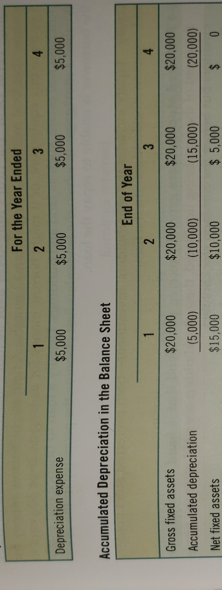

# Business Finance WTAMU FIN-3320 
### Summary: 
 Course efforts are directed toward understanding basic concepts and analytical techniques appropriate to financial management. The course relies upon an interactive lecture/problem-solving/peer-to-peer learning format. The subject matter is central to the successful management of any firm and future courses presume a strong grasp of this subject. Financial management represents the process of planning for, acquiring, and allocating funds by a business enterprise. This process involves several decision-making tools, including the time value of money, financial statement analysis and financial forecasting, working capital management, pricing various types of risk facing the firm, asset and project valuation, and determination of the firm’s optimal capital structure.  

 Book: Foundations of Finance 9th ed. 
 Authors: Keown, Martin, Petty
 Publisher: Pearson

### Table of Contents: 
- [Chapter 1: Introduction to the foundations of Financial Management](#Chapter-1:-An-Introduction-to-the-foundations-of-Financial-Management)  
- [Chapter 2: The Financial Markets and Interest Rates](#Chapter-2:-The-Financial-Markets-and-Interest-Rates)
- [Chapter 3: Understandign Financial Statements and Cash Flows](#Chapter-3:-Understandign-Financial-Statements-and-Cash-Flows)
- [Chapter 7: The Valuation and Characteristics of Bonds](#Chapter-7:-The-Valuation-and-Characteristics-of-Bonds)
- [Chapter 8: Valuation and Characteristics of Stock](#Chapter-8:-Valuation-and-Characteristics-of-Stock)

# Chapter 1: An Introduction to the foundations of Financial Management

### The Goal of the Firm: 
The fundamental goal of the firm is to create value for the owners, more commonly stated as 'maxamizing shareholders wealth'.   
- This is chosen because **all** financial descisions affect the firms stock price.

### The five principles that form the foundations of finance: 

#### 1. Cash Flow is what Matters
Cash flow represents money that can be spent and is different from profits. A firm can have negative profits but high cashflows, ie. Hollywood movies typically turn zero profits but have hight cashflows. 
Marginal, or incremental cash flows must also be taken into account, ie. Disney's movie frozen was successful not only from the film but other IP materials as well (toys, games and other movie related merch)

#### 2. Money has a Time Value
All money has a time value, for example, a dollar received today has more value than one received next year. We can invest the dollar today to accrue interest over the year, leading to a value of more than one dollar. 
**Opportunity cost:** _The highest-valued alternative that you had to give up when you made the choice_ 
Firms will use the concept of 'The Time Value of Money' to determine if a project should be accepted. 

#### 3. Risk Requires Reward
Investors will demand a reward for a risk being taken, the greater the risk, the greater the projected reward. Typically they will want a return that satisfies two requirements: 
- *A return for delaying consumption* Why would anyone make an investment if it returned nothing, even if there was no risk it would still be a foolish investment. 
- *An additional return for taking on risk* Investors don't typically like risks, thus risky investments are less attractive unless they are offering a greater reward. 

#### 4. Market Prices are Generally Right
*efficient market* is one in which the prices of hte assets traded in that market fully reflect all available information at any instant in time. Whether a market is effecient depends on the speed with wwhich newly released information is impounded into the prices. Profit driven investors in an efficeint market will act quicky to buy or sell stocks based on this new information. 
Stock prices are typically a good barometer on the value of a firm. 
- Naturally the real world is  never perfect, just look at the recession of 2008-2009 and the housing markets collapse. This isnt' an exact science, behavorial finance is still very much a work in progress, Robert Shiller once said, "*People think they know more than they do*" this over confidance can lead to people taking on more risks than they should, and this behavorial impact goes beyond just the stock market to analyzing new projects to forcast future cash flows for a firm. 

#### 5. Conflicts of Interest cause Agency Problems
Sometimes managers make decisions that are not in the best interest of the firm, rather in the own managers best interests. Conflicts of interest lead to *Agency Problems* which result from the seperation fo the management and ownership of the firm. Managers might not take on projects that have high return rates and low chance of failure becuase if the project fails the manager could lose their job. Agency problems contributed to the 2008-2009 financial crisis, brokers would create mortgages then sell them to someone else, since they only created the morgage they were not concerned with it's quality. These costs can be difficult to measure in the markets. The root of these problems is conflics of interest, for example: in 200 Edgerrin James was a running back for the Indianapolis Colts, and was told by his coach to run a first down then fall down. That way the Colts wouldn't be accused of running up the score on a team they were already beating really bad. Edgerrin had incentive payments accociated with number of yards ran and touchdowns, so instead of listening to his coach, Edgerrin acted in his own self interest and ran a touchdown on the next play. 
Managers can be monitored to avoid agency problems, typically by rating agencies and by auditing financial statements, compensation packages may also be used to allign managers views with shareholders. 

### The Essential Elements of Ethics and Trust
Not technically one fo the five principles, but without ethics and trust, nothing works. Virtually everything we do involves some dependence on others. In fact the 2008-2009 financial crisis was cause by a lack of ethics in the housing industry. 
Ethics has no clear cut definition, most people view it as "doing what's right" but everyone's view on what is right is radically different. This varies even more when working internationally. 
Ultimatly, unethical behavior destroys trust and business cannot operate without trust. 

### The role of finance in business
- What long-term investments should the firm undertake? this is typically referred to as **Capital Budgeting**
- How should the firm raise money to fund these investments? The firms funding choices are generally referred to as **capital structure decisions** 
- How can the firm best manage its cash flows as they arise in its day to day operations? This area of finance is generally referred to as **Working Capital Management** 

Why Study Finance? *Although finanace is primarilyh about the management of money, a key component of finance is the management of information* 

### The Legal Forms of Business ORganization

#### 1. Sole Proprietorships
A sole proprietorship is a *business owned by an individual* The owner retains the title to the business's assets and is responsible, generally wihtout limit, the the liabilities incurred by the business. Typically there is no legal requirement to be met in starting operation, particularly if hte proprietor is conductino the business in his or her own name. 

#### 2. Partnerships
A partnership is *an association of two or more persons coming together as co-owners for the purpose of operationg a business for profit* Partnerships typically fall into two types: 
- **General Partnerships:** in a general partnership each partner is fully responsible for all liabilities incurred by the partnership. The relationship amung partners is dictated entirely by the partnership agreement which may be an oral commitment or a formal document. 
- **Limited Partnerships:** In addition to general partnerships many states allow for Limited partnerships, the State statutes permit *one or more of the partners to have limited liability, restricted to the amount of capital invested in the partnership*. There are a few conditions, at least one general partner must have unlimited liabilty and secondly the names of the limited partners amy not appear in the name of the firm, Lastly limited partners may not participate in the management of the business. 

#### 3. Corporations
Corporations are defined as: *An artificial being, invisible intangible and existing only in the contemplation of the law* (Taken from *The Trustees of Dartmouth College v. Woodard*, 3 Wheaton 636 (1819)). As such corporations act as a legal individual, they can sue, be sued, purchase, sell and own property and it's personell are subject ot criminal punishment for crimes. Ownership is reflected in common stock certificates, each designationg the number of shares owned by it's holder. The number of shares owned relative to the number of shares outstanding determines the stockholders proportionate ownership in the business. The shareholders liabilty is confined to the amount of investment in the company. 
- **Double taxation on corporations** Corporations are double taxed; this occurs when a corporation earns a profit, pays taxes on those profits (first taxation) then pays some of those profits back to shareholders, where the shareholders pay personal income tax on those dividends (Second taxation). Currently taxation on dividends is capped at 20%, moreover if your personal income puts you in the 10-15% income rate bracket, you don't pay any tax on dividend income, and if you are in the 25-35% income bracket, you pay 15% on qualified dividends. 

#### 4. S-Corporations and Limited Liability Companies (LLC)
Double taxation provides a huge hurdle for entrepreneurs and small business owners looking to expand. Fortunatly the government has recognized the problem and has provided solutions: 
- **S-Corporation:** Provides limited liability while allowing the business's owners to be taxed as if they were a partnership. That is distributions back to the owners are not taxed twice as is the case with a corporation. There are several restrictions (not listed in the book) that make this form of business less desriable, mostly it is used as joint ventures between two corporations. 
- **Limited Liability Companies (LLC):** A cross between a partnership and a corporation. just as with the S-Corp, LLC retains limited liabilty for its owners, but it runs and is taxed like a partnership. In General it provides more flexability than an S-Corp. LLC's operate under state and IRS laws, state laws vary between states. Bottom line is that an LLC must not look to much like a corporation else it'll be taxed like one. 

# Chapter 2: The Financial Markets and Interest Rates
###### [Back to top](#Business-Finance-WTAMU-FIN-3320)
- Capital Markets: *All the finanaical institutions that help a business raise long-term capital* (Long term meaning) greater than 1 year
This section will focus on how business's go to raise money in the capital markets and helps to understand how capital markets work. 

### Financing of Business: The Movement of Funds through the Economy
In a healthy economy, funds are in constant motion, funds are moving from savings-surplus units into the hands of business's and people who need more money than they currently have. Say Bob & Melinda want to buy a $240K house but only have $50K saved up, where will the extra money come from? **Savings-Surplus units**, or those who spend less than they take in. These can be people or institutions such as banks and governments. 
#### How the Money Moves
- Direct Transfer of funds
	- Firms seeking cash sell securities directly to investors
	- **Angle Investor** Wealthy private investor, typically gives funds with no promise of a return. 
	- **Venture Capitalist** is a private equity investor that provides capital to companies exhibiting high growth potential in exchange for an equity stake.
- Indirect transfer using an investment firm
	- An investment-banking firm is a financial institution that helps companies raise capital, trades in securitites, and provides advice on transactions such as mergers and acquisitions. 
	- An investment-bank will buy all securities a firm wishes to sell, then resell them at a higher price to investors. 
	- The security is just being resold by the investment-bank, nothing changes about the security. 
- Indirect Transfer using a Financial Intermediary
	- Life insurance, mutual funds, and pension funds operate this way
	- Financial Intermediary will collect the savings of individuals and issue it's own (indirect) securities in exchange. The financial intermediary will then use the savings of these individuals to acquire other firms direct securities such as stocks and bonds. 
A good financial system is one that moves money from savers and into the hands of those who can best put that money to use.

### Public Offerings Vs. Private Placement
- Public offering: Both individuals and institutional investors will have an opportunity to purchase the securities. 
- Private Placement: Securities are offered and sold directly to a limited number of investors. 

### Primary Markest Vs. Secondary Markets
- Primary market: a market in which new, as opposed to previously issued, securities are traded. 
	- This happens when a company issues a new batch of stock
	- IPO: Initial Public Offering: The first time a company issues stocks to the public. 
	- SEO: Seasoned Equity Offering: The sale of additional shares by a company whose shares are already publicily traded. 
- Secondary Market: Where currently outstanding securities are traded (think used car market) 
	- If an individual bought stock in Google, then desired to sell said stock, he/she would sell in a secondary market. 
Both Primary and Secondary markets are regulated by the Securities and Exchange Commission (SEC)

### The Money Market Vs. The Capital Market
- Money markets are transactions in short term debt, maturitiy periods of less than one year. 
- Capital Markets are transactions in long-term debt, maturity periods of greather than one year

### Spot Markets Vs. Futures Markets
- Spot Markets: Aka Cash Markets, where something sells on the spot, today.
- Futures Markets: market where you can buy or sell something at a future date
	- in effect: you sign a contract stating what you're buying, how much, at what price and at which date.  

Biggest difference in these two markets is when it is delivered and when you pay for it

### Stock Exchanges: Organized Security Exchanges Vs. Over-the-Counter Markets
With the advance of technology, the difference between these two markets has blurred significantly. The most basic difference is that Organized Security Exchanges occupy physical space, there is a building you can go to (wall street) and financial instruments are traded on premesis. Over-the-Counter markets are any financial markets that aren't Organized Security Exchanges. 

- New York Stock Exchange (NYSE) Also called the "Big Board" and is the oldest of all the organized exchanges. Though today NYSE is technically a hybrid-market, it occupies physical space but it's offerings are traded nation-wide. 
- NASDAQ: Computerized over-the-counter market, most firms don't meet the requirements of an organized exchange or simply would rather be listed wiht NASDAQ. The system offers over 5,000 over-the-counter stocks and also facilitates trades by matching up buyers and sellers. 
#### Stock Exchange Benefits
- Providing an continouse market: argueably the most important function of the stock exchanges. This provides a series of continous prices as prices change from trade to trade and tend to be smaller than they would be in the absence of an organized market. 
- Establishing and Publicizing Fair Security Prices: Organized Exchanges permits security prices to be set by competitive forces rather than negotiations on the trade floor where one party might have a barganing advantage. Security Prices are set by supply and demand and are widely publicized. 
- Helping Business Raise new Capital: Because a continouse secondary market exists, it is easier for firms to float, or issue new security offerings at competitively determined prices. The means that the comparitive values of securities offered in these secondary markets are easily observed. 

### Selling Securities to the Public  
Most corporations do not raise long-term capital frequently. Most will seek aid from an investment banker serving as an underwriter that sells the stocks and bonds on a primary market. **Underwriting** process involves the purchase and subsequent resale of a new security issue. There is inherient risk in selling new securities *the difference between the price the corporation gets and the public offering price* is called the **Underwriters Spread** 

#### Functions
**Syndicate:** Group of investment-bankers
The investment banker performs 3 basic functions: 
- **Underwriting**: term is borrowed from the insurance industry, means *to assume risk* as the investment banker assumes the risk of selling the securities on the public market at a satisfactory price. 
	- On a given day, the firm will be presented with a check from the investment-bank and in exchange the bank receives the batch of securities. Now the firm already has the cash it needs and is immune should the price of those securities fall. The bank hopes the opposite will happen (naturally) and hopes the value of the securities will rise so they can sell them at greater profit than expected. 

- **Distributing**: Once the Syndicate owns the new securites it must get them into the hands of the investors. The investment banker may have brances all over the US or may make prior arrangements with several security dealers who regularly buy portions of each new offering for the final sale. It is not uncommon to have 300-400 dealers involved in the selling effort. 
- **Advising**: The investment banker is an expert in the issuance and marketing of securities, the banker can analyze a firm's capital structure and make recommendations about what general source of capital should be issued. 

### Distribution Methods
- **Negotiated Purchase:** For a firm that needs funds a method is negotiated with the investment banker for determining the price the syndicate will pay for the securities. EX: An investment banker agrees to pay $2 less than the closing price of stock the day before the issuance of new securities. 
- **Competitive Bid Purchase:** Several underwriting groups will place a bid on the newly issued securities and the highest bidder will be selected. The firm doesn't directly chose the syndicate. Most competitve bid purchases are confined to 3 situations: 
	1. Railroad issues
	2. Public utility issues
	3. State and municipal bond issues
- **Commission or Best-Effort Basis:** Investment-banker acts as an agent rather than as a principal in the distribution process. Securities are **not** underwritten rather the investment-banker sells the securities in exchange for a fixed commission on each security sold. Unsold securities are then returned to the firm. 
- **Privileged Subscription:** When a new issue is marketed to a definate and select gorup of investors it is called a privileged subscription, these rights are also called *rights offerings*. Sometimes there is a *standby agreement* where the investment bank will not underwrite securites sold to the privileged investors. Three target markets are typically involved: 
	1. Current Stockholders
	2. Employees
	3. Customers of the Firm
- **Dutch Auction:** Investors first bid on the number of securities to purchase and the price they are willing to pay for them. Once all bids are in, the prices that were bid along with the number of shares are ranked from the highest price to the lowest. the selling price of the stock is then calculated as the highest price that allows for all the stock to be sold. 
- **Direct Sale:** The issuing firm sells the securities directly to the investing public without involving an investment banker. Though, even amungst seasoned firms, this process is relativley rare. 

### Private Debt Placement
This focuses on debt issuance rather than stock offerings. This debt side of the private placement markets makes up a significant protion of the total private market. The major investors in private placements are large financial institutions. Based on volume of securities purchased, the 3 most important investor groups are:  
1. Life insurance compaines
2. State and local retirement funds
3. Private pension funds  

Private placements have advantages and disadvantages when compared to public offerings: 
#### Advantages: 
- Speed: Firms typically obtain funds faster through private placement becuase registration with the SEC is not required. 
- Reduced Costs: Savings result because the lengthy registration statement with the SEC doesn't have to be prepared. 
- Financing Flexibility: in private placement the firm deals on a face-to-face basis with a small number of investors, allowing them to tailor the terms of the issue to better suit the firms needs. 

#### Disadvantages: 
- Interest Cost: It is generally conceded that the interest cost on private placements exceed those of public issuance. 
- Restricitive Covenants: A firms dividend policy, working capital levels and the raising of additional debt may all be affected by provisions in the private placement debt contract. There can be restrictions placed on public debt issuances as well. But the restrictions can be especially burdensome in private contracts. 
- The Possibility of Future SEC Registration: If the lender(investor) should decide to sell the issue to a public buyer before maturity, the issue must be registered with the SEC. 

### Flotation Costs
2 Types of Flotation cost incurred: 
1. The underwriters spread 
	- greater of the two, cost wise, simply the difference in what the investment bank paid for the securities and what they sold them for. 
2. Issuing costs
	1. printing and engraving of the security certificates
	2. legal fees
	3. accounting fees
	4. trustee fees
	5. several other miscellaneous components
	- Two most significant costs are Printing and engraving, then legal fees. 

Data published by the SEC have consistently revealed two relationships about flotation costs: 
1. The costs associated with issuing common stock are noteable higher than than preffered placement
2. The flotation costs (expressed as a percentage of gross proceeds) decrease as the size of the security issue increases. 

### The Sarbanes-Oxley Act: Regulation Aimed at Making the Goal of the Firm Work
Due to increased concerns about both agency and ethical issues congress pased the Sarbanes-Oxley (SOX) act in 2002, a primary driver for this law was the failing of Enron in December 2001. SOX holds corporate advisors who have access to or influence on company decisions (accountants, lawyers, company officers and board of directors) legally accountable for any instances of misconduct. Opinions on the law are mixed, despite having recieved praise from the former Federal Reserve Chair Alan Greenspan and has increased investor confidence in financial reporting. The demanding reproting requirements are quite costly and as a result may inhibit firms form listing on US Stock markets. 

### Rates of Return in the Financial Markets
**Opportunity cost of funds** The rate of return on the next best investment alternative to the saver. 

### Rates of Return over Long Periods 
Common stocks have more risk than long-term corporate bonds, typically the annual return on stock is 10.1% 
**Inflation-risk premium:** The investor who earns only the rate of inflation ahs earned "no real return". That is the *real* return is the return earned aboute the rate of increase in the general price level for goods and services in the economy, which is the inflation rate. 
>TODO: Add Figure 2.3 from book, pg.35

### Interest Rate Levels in Recent Periods
>TODO: Add Table 2-2 and Figure 2.4 from book, pg. 36
In the graph/Table we can observe: 
1. Inflation-Risk Premium
2. The default-risk premium across several instruments
3. the approximate real return for each investment

Investors requrie a *nominal rate of interest* that exceed the inflation rate else their realized real return will be negative. The **Default-Risk premium* is described in both figures..also evident here:  
| **Security** | **Average Yield** |
|---|---|
|30yr Treasur Bonds | 5.49% |
30yr AAA Corproate Bonds | 6.35% | 

The preceeding array of numbers can also used ot identify another factor that affects interest rate levels. The **Maturity-Risk Premium** *the additional return requried by investors in longer-term securities (bonds in this case) to compensate them for the greater risk of price fluctuations on those securities caused by interest rate changes*   
One other type of risk premium that helps determine interest rate levesl is the **Liquidity-Risk Premium** *the additional return requried by investors in securities that cannot be quickly convereted into cash at a reasonable price* For example: The stock of a local bank will be less liquid than that of Wells Fargo. 

### Interest Rate Determinants in a Nutshell
Utalizing the logic from **Principle 3: Risk Requires Reward** we can deconstruck the interest rate paid on a asecurity into a simple equation with the nominal interest rate equal to the sum of trhe real risk-free interest rate plus compensation for taking on several different types fo resk and several risk-premiums. **Real risk-free interest rate** *the required rate of return on a fixed-income security that has no risk in an economic environment that has zero inflation* 

#### Nominal interest rate = real risk-free interest rate + inflation premium + default risk premium + maturity-risk premium + liquidity-risk premium 
WHERE: 
- Nominal interest rate = The quoted interest rate and is the interes rate paid on debt securities without an adjustment for any loss in purchasing power. 
- Real risk-free interest rate = The interest rate on a fixed-income security that has no risk in an economic environment of zero inflation. It can also be stated as the nominal interest rate less the infaltion, default risk, maturity risk and liquididty risk premiums
- Infaltion Premium = A premium to compensate for anticipated inflation that is equal to the price change expected to occur over the life of the bond or investment instrument. 
- Default-Risk Premium = The additional rate of return requried by investors to compensate for the risk of default. It is calcualted as the difference in rates between a US Treasury bond and a corporate bond of the same maturity and market ability. 
- Maturity-Risk Premium = The additional return requried by investors in longer-term securities to compensate them for the greater risk of price fluctuation on those securities caused by interest rate changes. 
- Liquidity-Risk Premium = THe additional rate of return requried by investors for securities that cannot be exchanged quickly for cash at a reasonable price. 

### Estimating Specififc Interest Rates Using Risk Premiums
By using knowledge of various risk-premiums as contained in the above equation, a financial manager can generate useful information for the firms financial planning process. It is possible for the financial manager to estimate and better understand what interest rate (yield) would satisfy the market to help ensure that the bonds are actually bought by investors 

### Real Risk-Free Interest Rate and the Risk-Free Interest Rate
The difference between the two is that the risk-free interest rate includes compensation for inflation, where as the real risk-free interest rate is the risk-free rate *after* inflation. 
- Risk-free interest rate = real risk-free interest rate + inflation premium
- Real risk-free interest rate = risk-free interest rate - inflation premium

Furthermore the term *risk-free* indicates there is no compensation for default-risk, maturity-risk, and liquidity-risk premiums. That is, it is the return if there were no risk and no inflation. 

### Real and Nominal Interest Rates
Nominal interes is the observed rate, the nominal rate of interest tells you how much money you'll earn in interest. 
**Real rate of Interest** is *the rate of increase in your actual purchasing power, after adjusting for inflation.* NOTE: the real rate of interest is not a risk-free rate, it includes both the real risk-free rate of interest along with compensation for the default-risk, maturity-risk and liquidity-risk premiums. Nominal interest is calcualted as follows: 
- Nominal interest rate ≈ Real rate of interest + inflation Premium
	- This equation says that the nominal rate of interest is aproximatly equal to the real interest rate plus  the infaltion premium and proviedes a quick and *approximate* way of estimating the real rate of interest by solving directly for this rate. 

### Inflation and Real Rates of Return: The Financial Analyst's Approach
- Nominal interest rate - inflation rate ≈ real interest rate

Concept is straight forward algebraic adaptation of the previously stated equation but it's implementation requries that several judgements be made. Suppose we want to use this relationship to determin the real risk-free interest rate. Which interest rate series and maturity period should be used? Suppose we settle for using some US Treasury security as a surrogate for nominal risk-free interest rate. then, should we use the yield on 3 month US Treasury bills or, perhaps the yield on 30 year Treasury Bonds? There is no absolute answer.  
Example:  
Suppose that an analysit wants to estimate the approximate real interest rate on: 
1. 3 month Treasury bills
2. 30 year Treasury bonds
3. 30 year AAA Corporate bonds  
All from the 1990-2014 time frame, furthermore the annual rate of change in the consumer price index is considdered a logical measure of past inflation experience.  
Data:

| **Security** | **Mean Nominal Yield (%)** | **Mean Inflation Rate (%)** | **Inferred Real Rate (%)** |
|---           |---                         |---                          |---                         |
| 3 Month Treasury Bills | 3.04 | 2.64 | 0.40 |
| 30 Year Treasury Bonds | 5.49 | 2.64 | 2.85 | 
| 30 Year AAA Corproate Bonds | 6.35 | 2.64 | 3.71 | 

Notice that the mean yield and inflation rate over 25 years from 1990 - 2014 on all three classes of securities has been used. The last column provides the approximation for the real interest rate on each of class of security. 

### The Term Structure of Interest Rates 
**Term Structure of interest rate** Or the **Yield curve** is defined as *the relationship between a debt security's rate of return and the length of time until the debt matures* For this relationship to be useful to us all the factors, other than maturity must remain constant. Thus the *Term structure reflects observed rates or yields on similar securities, except for the length of time until maturity, at a particular moment in time* 

### Shifts in the Term Structures of Interest Rates
The term structure of interest rates changes over time as expectations change

### What Explains the Shape of the Term Structure? 
1. The unbiased expectations theory
	- *the term structure is determined by an investor's expectations about future interest rates.* Lets say we have $10k to invest in two different government securities, one matures in 2 years at a 9% interest rate and the other matures in 1 year at an 8% rate, we're investing the $10K for 2 years so we'll buy the 1 year security twice. Lets compare them: 

	| 2 year Security | | 
	| ---| ---|  
	| Principal Amount | $10,000 |
	| Plus 1 year interest (0.09 * 10,000) | 900 |
	| Principal plus interst at the end of year 1 | $10,900 | 
	| Plus year 2 interest (0.09 /010,900 | 981 | 
	| Principal plus interest at the end of year 2 | $11,881 | 

	- If we go the 1 year route, we cannot determine next years interest rate, however we can calculate the rate needed to give us the same 2-year total savings. 

	| 1 Year Security | | 
	| --- | --- | 
	| Savings needed in 2 years | $11,881 | 
	| Savings at the end of year 1 [$10,000(1 + 0.08)] | $10,800 |
	| Interest need in year 2 | $1,081 | 

	- For us to receive the $1,081 in teh second year we'd need aprox 10% return rate. 
		- Interst received in year 2 / Investment made at beginnign of year 2 = 1081 / 10800 == 10.0093%

2. The liquidity preference theory
	- In investing our $10K as we did above we did not care about the associated risks, these were govt securities afterall. Supposed we were ok with a little risk and sought out a security with .5% additional interest. This is the *risk premium* the additional interest earned for assuming more risk. According to **liquidity preferenc theory** *investors requrie maturity-risk premiums to compensate them for buying securities that expose them to the risks of fluctuationg interest rates* 

3. The market segmentation theory
The market segmentation theory of term structure of interest rates is built on the notion that legal restrictiosn and personal preferences limit choices for investors of certain rages of maturities. At an extreme the market segmentation theory implies that *the rate of interest for a particular maturity is determined soley by demand and supply for a given maturity and that it is independent of hte demand and supply for securities having different maturities*

# Chapter 3: Understandign Financial Statements and Cash Flows  
###### [Back to top](#Business-Finance-WTAMU-FIN-3320)  
1. The Income Statement
2. The Balance Sheet
3. Measuring Cash Flows
4. GAAP and IFRS
5. Income Taxes and Finance
6. Limitations of Financial Statements and Accounting Malpractice
7. Free Cash Flows

### The Income Statement
An **income statement** or profit and loss statement indicates the amount of profit generated by a firm over a given time period, typically 1 year. The most basic form is stated as such:  
> Sales - expenses = profit
#### Income Statement Makeup
Income statement begins with sales or revenue from which we subtract **Cost-of-goods sold** to yield gross profits. Next we subtract **Operating expenses** to determine **operating income** (also called Operating profits or Earnings before interest and taxes (**EBIT**))
> Operating expenses = Marketing/selling expenses - General/Adminstrative Expenses
##### Where: Marketing and  selling expenses are the cost of promoting the firms products and services to it's customers
##### General and adminstrative expenses are the firm's overhead expesnses such as executive salary and rent. 

1. Sales (revenues) which is equal to the selling price of the products or services to be sold times the number of units sold (Selling price x units sold = total sales)
2. Cost of Goods sold: which is the cost of producing or acquirirng the goods or services that were sold. 
3. Operating Expenses
	- Marketing and selling expenses (the expesnses related to marketing, selling and distributing the products or services)
	- The firm's overhead expenses (general and admin expenses and the depreciation expense) 

### The Balance Sheet
A balance sheet shows the firms financial position at a *specific point in time* where as the income statement shows financial position for a *period of time*. In it's most basic form the balance sheet is determined as follows 
> Total Assets = total debt (liabilities) + Total Shareholder equity
##### Where: Total assets represents the resources owned by the firm
##### total liabilities and total shareholders equity indicate how those resources were financed. 
By convention the practice is to report the amount of a firms various assets in the balance sheet by using the actual cost of acquirirng them. Thus the balance sheet does not represent the current market value of a company's assets and *does not* reflect the value of the company itself. RATHER *it reports historical transactions at their cost* or the companies accounting **Book Vlaue** 
### Types of Assets 
On the balance sheet assets are always listed from most liquid to least liquid. 
1. Current Assets
	- aka *Gross Working Capital* 
	- Assets that can be converted into cash in less than 12 months
	- Current assets include
		1. Cash
			- have to have cash to conduct business operations because of the uneven flow of funds into cash receipts and out of cashe expenditures. 
		2. Accounts Receivable
			- Amounts owed to the firm by it's customers who buy on credit. 
		3. Inventories
			- A companies inventories consist of raw materials, work in progress, and finished goods held by the firm for eventual sale. 
		4. Other current assests
			- Items such as pre-paid expenses (insurance premiums, pre-paid rent) These expenditures are considered assets because they represent an investment made by the company. 
	- Long Term Assets
		1. Fixed assets
			- Property, Plant and Equipment
			- Not immediatly reported on the income statement because it's an asset, goes on the balance sheet. 
			- Often incur **depreciation expense**
				- With depreciable assets the original cost of an asset is allocated as an expense in the income statement over the asset's expected useful life. The sum of all depreciation taken up to the date of the balance sheet are shown as **accumulated depreciation** in the balance sheet. 
			- Gross fixed assets vs net fixed assets
				- Fixed assets are subject to depreciation as they lose their value due to wear and tear, obsolences. Gross fixed assets shows the historical value of the asset whereas net fixed asset shows the book value of the asses and is calculated as gross fixed asset less accumulated dpreciation. 
			- 
		2. Other Long-term Assets
			- Long term investments
			- intangible assets (patents, trademarks and goodwill)
				- **Goodwill** occurs when a company purchases antohre business that has an economic value greater than the value of the individual asset, the difference is recorded as **Goodwill**

### Types of Financing
1. Debt
	- Debt or liabilities is financing provided by a creditor. It is divided into two types: 
		1. Current or short-term Debt: any debts which must be repaid in 12 months or less. Short term debt includes the following
			- Accounts Payable
				- credit suppliers extended to the firm when it purchased inventory aka **Trade Credit**
			- Accrued Expenses
				- shrot term liablities that have been accrued by the firm but not yet paid (employee wages) 
			- Short-term notes
				- ammoutns borrowed from a bank or other lending source that are due within 12 months
			- Other current liabilites (taxes or interest payable) 
		2. Long-Term Debit
			- Loand from banks or other lenders that need to be repaid over the course of more than one year. ie. A firm might take out a 5 year loan to purchase equipment, or **Mortgage** some land or property (paid over 15-30 years)
2. Equity
	1. Preferred Stockholders
		- generally receive a dividend that is fixed in amount. Should the firm be liquidated, the preferred stock holders are paid before the common stock holder and after the creditors. 
	2. Common Stockholders
		- residual owners of business. They receive whatever income is leftover after paying all expenses. The ammount of a firms common equity is the sum of two items: 
			1. Amount a company receives from selling it's stock to investors: 
				- This amount may simply be shown as **Common Stock** on balance sheet or **Par Value** (an arbitrary amount a firm puts on each share of stock when it's sold) and **paid-in capital** above par (also called capital surplus)
			2. Retained Earnings: The net income that has been retained in the business rather than being distributed to the shareholders over the life of the company. We take a *cumulative total of all the net income over the firm's life less the common stock dividends that have been paid over those years*
			> Beginings retained earnings + Net income for the year - Dividends paid during the year = Retained Earnings

			Common Stockholders Equity is calcualted as: 
			> Common equity = common shareholders investment + cumulative profits - Cumulative dividends paid to common stockholders. 

| Common Stock        |            |
| ------------- |:-------------:|
|Par value (1$ x 1,000 shares)  | $1,000 |
| Paid in capital ($99 x 1,000) | 99.000 |  
| Total increase in Common Stock      | $100,000  |

### Working Captial 
Earlier we noted that *current assets* may be referred to as *gross working capital* By contrast, **Net Working Capital** is equal to the companies current assets less it's current liabilities
> net working capital = current assets - current liabilities  
This is essentially a comparison of a companies current assets and currnet liabilities. The Larger a net working capital the better a firm is able to pay it's debts as they come due. 

### Measuring Cash Flows
#### Profits vs. Cash Flows
*Profits do not equal Cash Flows*  
*An income statement is **Not** a measure of cash flows becuase it's calculated on an accrual basis rather than a cash basis* 
- Accrual basis accounting
	- Profits are recorded when earned. Whether or not the profits ahve been received in cash. Expenses are recorded when they are incurred. Even if money has not been paid out. 
- Cash basis accounting
	- Profits are reported when cash is received and expenses are recorded when they are paid. 

### The Beginning point: Knowing when a change in the balance sheet is a source or use of cash
| Sources of Cash | Use of Cash | 
|--- | ---|
| **Decrease in an asset** | **Increase in an asset** | 
| Example: Selling invetories or collecting receivables provides cash | Example: Investing in fixed assets or buying mor inventory uses cash | 

# Chapter 7: The Valuation and Characteristics of Bonds  
###### [Back to top](#Business-Finance-WTAMU-FIN-3320)  
### Table of Contents: 
1. Types of Bonds
2. Terminology and Characteristics of Bonds
3. Defining Value
4. What Determinds Value
5. Valuation: The basic process 
6. Valuing Bonds
7. Bond Yields 
8. Bond Valuation: Three Important Relationships

> A Bond is a type of debt or long-term promissory note, issued by the borrower, promising to pay it's holder a predetermined and fixed amount of interest per year and the face value of the bond at maturity    

---

## Types of Bonds: 

### Debentures
- Unsecured long-term debt
- Riskier than secured bonds but have higher interest rate
- No firm assets are put up as collateral, allowing the firm to issue debt and still preserve some ability to borrow in the future 

### Subordinated Debentures
- if firms have more than one outstanding Debentures, they might reorganize it into a hierarchy
	- some Debentures are given a `Subordinated standing in case of insolvency`
	- The claims on this debt are only satisified **AFTER** claims of secured debt and unsubordinated debentures have been satisified. 

### Mortgage Bonds
- Bond secured by lien on real property 
- Usually value of real property is greater than the value of the bond 
- in the case of forclosure: 
	- allows trustee's to sell property and distribute resulting funds to bondholders 
	- bond trustee is usually a banking institution 
	- should sale of property not cover the bonds bondholders become general creditors for the remaining portion of unpaid debt 

### Eurobonds
- Bond issued in a country different from the one in which the currency of the bond is denominated. 
	- ex: a bond issued in Europe but interest is paid in US dollars. 
	- bond needs to be sold in another country different from the one where the bonds currancy is denominated 
- Eurobonds are **NOT** registered with the SEC (Securities and Exchange Commission) 
- favorable rates of return 
- less rigorous disclosure requriements than those of SEC 
- may **NOT** be offered to US citizens and residents

### Convertable Bonds 
- debt securitites that can be converted to a firm's stock at a prespecified price. 
	- ie. buy bond wiht face value of $1000, maturing in 6 years. in 6 years time you can either take the total pay out of $1000 or since the company offered conversion at $50/stock you could take 20 stocks in the firm. Taking the option would be dependant on the currant price of the firm's stock at the time of the bonds payout. should valueation of stock be greater than $50 you could take the stock option and increase the bond payout (dividends or selling stock outright). 

## Terminology and Characteristics of Bonds

### Claims on assets and income
- in the case of insolvency within the firm: 
	- bonds take priority over that of common stockholders 
- different types of debt can have a hierarchy among themselves 

### Par Value 
- Face value of bond, which is returned to bond holder at time of maturity
- Bonds are generally expressed as a percent of par value (generally 100% == $1,000)

### Coupon interest rate
- percentage of the par value of the bond that will be paid out annually in the form of interest 
- The investor receives a fixed dollar income each yuear from the interst; These bonds are called **Fixed-rate bonds**
- **zero coupon bonds** have a zero or very low coupon rates. Instead of paying interest rates the company sells the bond at a substantial discount below the $1,000 par or face-value. 

### Maturity
- the lenght of time until the bond issuer returns the par value to the bondholder and terminates or redeems the bond. 

### Call Provision
- Bonds may be called or redeemed before their time is up
	- Firms will ususally do this if interest rates start to decline. therefore they can pay off the debts at a lower rate
- Call protection period is a preset amount of time where a company cannot recall a callable bond. 

### Indenture
- legal agreement between firm issuing the bonds and the trustee, who represents the bondholders. 
- The indenture will provide specific terms on the bond, including a description of the bond as well as the rights of the bondholders. The terms are designed to protect the bond from managerial activities that would weaken the bonds standing. 
- Limits placed on bonds typically include: 
	1. Prohibiting the sale of the firms accounts receivables 
	2. limiting common stock dividinds. 
	3. restricting the purchase or sale of the firms fixed assets
	4. Setting limits on additional borrowing by the firm. 

### Bond Ratings
- 3 main rating agencies of bonds 
	1. Moody's 
	2. Standards & Poor's
	3. Fitch Investor Services
- Ratings deal with bond expectations but several factors have historically influence bonds 
	- Greater reliance on equity as opposed to debt in financing the firm. 
	- Profitable operations 
	- low variability in past earnings
	- large firm size
	- little use of subordinated debt 
- Bonds rating will affect it's interest rate. (higher risk bonds carry a higher interest rate, also has higher chance of default on the bond) 
- Junk bonds or High Yield bonds: are those that are rated lower than *BB* by Moody's and Standards & Poor's. These typically have interest rates 3-5% higher than those of AAA rated bonds. 
- Bond Ratings
	- **AAA** highest rating assigned by standard and poors for debt obligations and indicates an extremely strong capacity to pay principal and interest. 
	- **AA** Bonds rated AA also qualify as high quality debt obligations. Their capacity to pay principal and interest is very strong; in the majority of instances, they differ from AAA issues only by a small degree. 
	- **A** Bonds rated A have a strong capacity to pay principal and interest, although they are somewhate more susceptible to the adverse effects of changes in circumstances and economic conditions
	- **BBB** Bonds rated BBB are regarded as having an adequate capacity to pay principal and interest. whereas they normally exhibit adequate protection parameters, adverse economic conditions or changing circumstances are more likely to lead to a weakened capacity to pay principal and interest for bonds in this catagory than for bonds in the A catagory
	- ** BB B CCC CC ** => Bonds rated BB, B, CCC, or CC are regarded, on balance, as predomiinantly speculative with respect to the issuer's capacity to pay interest and repay principal in accordance with the terms of obligation. BB indicates the lowest degree of speculation, and CC is the highest. Although such bonds will likely have some quality and protective characteristics, they are outweighted by large uncertainties or major risk exposures to adverse conditions. 
	- ** C** This rating is reserved for bonds that are paying 0 interest. 
	- **D** Bonds rated D are in default; and payment of principal and/or interest is in arrears. 

---

## Defining Value
- Value is defined differently depending on it's context. For us, in finance, value is the present value of future cash flows expected to be received from an investment, discounted at the investor's required rate of return. 
- Book Value: value of an asset as shown on the firms balance sheet. It represents the historical cost of the asset rather than it's current market value. 
- Liquidation value: dollar sum that could be realized if the asset were sold right now, for cash. 
- Market value: The value observed in the marketplace 
- Intrisic or economic value (fair value): The present value of an asset's expected future cash flows. This value is the amount the investor considers to be a fair value given the amount, timing adn riskiness of future cash flows. 
- Efficient market: market in which the value of all securitites fully recognize all available public information. 
- Behavioral finance: the field of study that examines whether investors act rationally or irrationally when making investment descisions

### 3 Major factors in determining value
1. Amount and timing of future cash flows
2. the riskiness of the cash flows
3. the investors attitude towards risk 

### Valuation: The basic process 
- Assigns value to an asset by calculating the present value of its expected future cash flows using the investors required rate of return as the discount rate. Investors required rate *r* is determined by the level fo the risk-free rate of interest and risk premium that the investor feels is necessary compensation. 
- `V = Cn / ( 1 + r)^n`
- where: 
	- `V` = Intrisic value, or present value of an asset producing expected future cashflows (`C`) in years 1 through `n`
	- `C` = Cash flow to be received at time `t`
	- `r` = Investors requried rate of return 
	- `n` = number of years 

### Valuing bonds 
- Present value of bond plus the future interest to be received and the par or maturity value of the bond. 
- Process for valuing a bond, need to know 3 things: 
	- The amount and timing of the cash flows to be received by the investor. 
	- the time to maturity of the bond
	- the investor's required rate of return 
- Calculating bonds value: 
	- **STEP 1** Estimate the amount and timing fo the expected future cash flows. Two types of cash flows are received by the bondholder
		- annual interest payments equal to the coupon rate of interest times the face value of the bond. 
		- the face value to be received at bond maturity
	- **STEP 2** Determine the investor's required rate of return by evaluating the riskiness of the bond's future cash flows. Required rate of return is equal to the rate earned on a risk-free security plus a risk premium for assuming risk. 
	- **STEP 3** Calculate intrinsic value of the bond as the present value of the expected future interest and principal payment discounted at the investor's requried rate of return. 
	- value of bonds Equation: 

### Bond Yields 
- There are two calculations used to measure the rate of return a bondholder receives from owning a bond. 
	- Yield to maturity
	- Current yield 

### Yield to Maturity
- The yield to maturity is the rate of return the investor will earn if the bond is held to maturity, provided, of course, that the company issuing the bond does not default on the payments. (This is equal to the expected rate of return) 
- We compute the yield to maturity by finding the discount rate that equates the present value of the future interest payments and principal payment to the bond's current market price. 

## Current Yield
- The current yield on a bond is the ratio of the annual interest payment of the bond’s current market price. 
- The current yield is not an accurate measure of the bondholder’s expected rate of return from holding the bond to maturity. 

## Bond valuation, Three important relationships 

A. Relationship 1 A decrease in interest rates (required rates of return) will cause the value of a bond to increase; an interest rate increase will cause a decrease in value. The change in value caused by changing interest rates is called interest rate risk. 
B. Relationship 2 1. If the bondholder's required rate of return (current interest rate) equals the coupon interest rate, the bond will sell at par, or maturity value. 2. If the current interest rate exceeds the bond's coupon rate, the bond will sell below par value or at a discount. 3. If the current interest rate is less than the bond's coupon rate, the bond will sell above par value or at a premium. 
C. Relationship 3 A bondholder owning a long-term bond is exposed to greater interest rate risk than an investor owning a short-term bond.  

# Chapter 8: Valuation and Characteristics of Stock
###### [Back to top](#Business-Finance-WTAMU-FIN-3320)
- Preferred Stock
- Valuing Preferred Stock
- Common Stock
- Valuing Common Stock
- Expected Rate of Return of Stockholders

As previously noted, the primary goal of finance managers should be to increase the value of a firms common stock. Thus, we need to understand what determines stocks value. Also, only with an understanding of valutation can we compute a firm's cost of capital, a concept essential to making effective capital investment decisions-an issue to be discussed in chapter 9.

## Preferred Stock
- **Preferred Stock** aka Hybrid Security becuase it has many characteristics of both common stock and bonds. 
	- Similarities to common stock: 
		- no fixed maturity date
		- if the firm fails to pay dividends, nonpayment does not bring on bankrupcy
		- dividends are not tax deductible
	- Similarities to Bonds:
		- Dividends are in fixed amounts
			- The amount is usually a fixed dollar amount or percentage of par value. 
### Characteristics of preferred stock
- **Multiple Series** if a company desires they can issue multiple series of preferred stock. with each series having it's own unique characteristics (ie. series A is convertable whereas Series B is not) 
- **Claims on Assets and Income** Preferred stock has a greater claim on assets in the event of bankrupcy compared to common stock, preferred stockholders claim comes in after the claims of bondholders have been satisified. If there is a series of stock, the company ususally has defined an heirarchy for the series. 
- **Cumulative Dividends** Requirement that all past, unpaid preferred stock dividends to be paid before any common stock dividends are declared. 
- **Protective Provisions** allow for voting rights in the event of nonpayment of dividends, or they restrict the payment of common stock dividends if the preferred stock payments are not met or if the firm is in financial difficulty. 
	- ie. if preferred stock dividends are 6 quarters in arrears the preferred stockholders get voting rights to elect the majority of the board of directors. 
- **Convertibility** aprox 33% of all preferred stock issued is convertable, allowing the stockholder to convert the preferred stock into common stock at a preset rate. ie. 1 preferred stock is equal to 2 common stock. 
- **Retirement Provision** entitles a company to repurchase its preferred stock from holders at stated prices over a given time period. SEC recommends this for all preferred stock.
	- sinking-fund provision: requires the company to set aside funds for the sole purpose of repurchasing preferred stock that is set for retirement. ie. Xerox Corporation has 2 series of preferred stock, one that has a 7 year sinking-fund provision and another that has a 17 year sinking-fund provision. 
	
## Valuing Preferred Stock
- **STEP 1** Estimate the amount and time of the receipt of the future cash flows the preferred stock is expected to provide. 
- **STEP 2** Evaluate the riskiness of the preferred stock's future dividends and determine the investors required rate of return. 
- **STEP 3** Calculate the economic, or intrinsic value of the share of preferred stock, which is the present value of the expected dividends discounted at the investors requried rate of return. 
	- Described as follows
		- Preferred stock value is equal to the divided in year 1 divided by 1 plus the investors requried rate of return. 
		- Vps = D / rps
- In summary the value of a preferred stock is the present value of all future dividends. 

## Common Stock 
- **Common Stock** is a certificate that indicates ownership in a corporation. 
- Common stockholders are the true owners of a firm, whereas bondholders and preferred stockholders are more like creditors than owners. 

### Characteristics of Common Stock
- **Claim on Income** as the owners, the common stockholders have the right to the residual income after creditors and preferred stockholders have been paid. This income may be paid directly to the shareholders in the form of dividends or it may be retained for reinvestment within the firm. Both actions will benefit the shareholders. 
- **Claim on Assets** owners also have residual claim on firms assets in case of liquidation. this claim is not usually satisified as creditors and bondholders have first and second claim on the assets. This residual claim on assets increases risk of common stockholders. 
- **Limited Liability** common stockholders have a liability limited to the amount of their investment. 
- **Voting Rights** common stockholders are entitled to elect members of the board of directors, and common stockholders are, in general, the only security holders given a vote. 
	- Usually vote via a **Proxy** or a designated party the given the temporary power of attorny to vote for teh signee at teh corporations annual meeting. Generally the firms management solicits the proxy vote, should financial performance be good, they usually have no trouble soliciting the votes. However if performance has been poor **Proxy fights** have been known to take place, where proxies are battling for proxy votes. 
	- 2 forms of voting 
		- **Majority voting** Each share of stock allows the shareholder one vote and each position on the board of directors is voted on seperatly. 
		- **Cumulative Voting** each share of stock allows the stockholder a number of votes equal to the number of directors being elected. Designed to give minority shareholders greater say in voting on board of directors
- **Preemptive Rights** entitles common stockholder to maintain a proportionate share of ownership in the firm. shoudl the firm issue a new series of stock the current common stock holders have an option on this new series equal to the amount of common stock they currently own. Shoudl I own 25% of a company I am entitled to purchase 25% of the new issuance of stock to maintain my 25% ownership. Else every new issuance of stock would dilute my level of ownership within the firm.

## Valuing Common Stock
- Like bonds and preferred stock, common stock value is equal to the present value of all future cash flows (dividends in this case) expected to be received by the stockholder. *However* Common stock does not have a garunteed dividend like preferred stock does. For common stock the divided is based on profitability of the firm. 	
	- Common Stock value is equal to teh dividend in year 1 divided by the required rate of return minus the growth rate of the company. 
	- Vcs = D1 / rcs - g
		- where g = ROE x pr 
		- ROE = Return on equity (net income divided by common book value) 
		- pr = company's percentage of profits retainted, called *profit-retention rate* 
			- retention rate is equal to ( 1 minus the percentage of profits paid out in dividends) 

## The Expected Rate of Return of Stockholders
- The rate of return the investor can expect to earn from the investment if it is bought at the current market price. 
	- Expected rate of return is equal to the annual divided divided by the preferred stock market price 
	- rps = D / Pps
	- rps = D / Pps

# Cost of Capital
- The return a company needs in order to take on a capital project, such as purchasing new equipment or constructing a new building. 
	- usually comprised of both equity and debt 
	- returns should exceed costs of financing the project else investors will not see a return. 
	
- Early stage companies will typically choose equity financing because they typically lack the assets to put forth as collateral for debt financing. Less-established companies will pay a higher interest rate on financing because of a lack of financial history; investors will demand a higher risk-premium. 
- The cost of debt is merely the interest rate paid by the company on its debt. However, since interest expense is tax-deductible, the debt is calculated on an after-tax basis as follows:
	- Cost of Debt equals interest expense divided by Total Debt, then multiplied by 1 minus the company's marginal tax rate
	- Cost of Debt =  Interest Expense / Total Debt \* (1 - T)
	- Where: 
		- Interest expense = Int. Paid on the firms current debt
		- T = The company's marginal tax rate
		- 
		
## Finding the Cost of Equity: 
- The cost of equity is approximated by the capital asset pricing model as follows: 
  

- A *Beta* is used in CAPM formula to estimate risk. 
	- public companies *Beta* woudl require a companies own stock *Beta*
	- Private companies *Beta* is estimated based on the average beta of a group of similar, public firms. The assumption is that the privat company *Beta* would be the same as the industry average.  
- A Firms overall cost of capital is based on the weighted average of these costs. Example: An enterprise with a capital structure consisting of 70% equity and 30% debt; it's cost of equity is 10% and after-tax cost of debt is 7%
	- Weighted average of Cost of capital is: 
	- (0.7 x 10%)+(0.3 x 7%) = 9.1%

