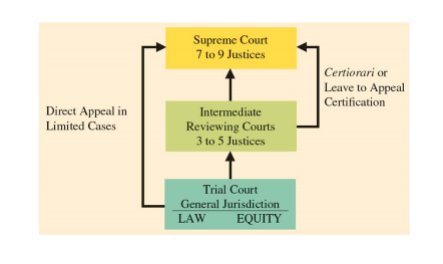
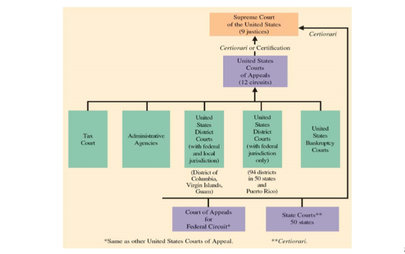
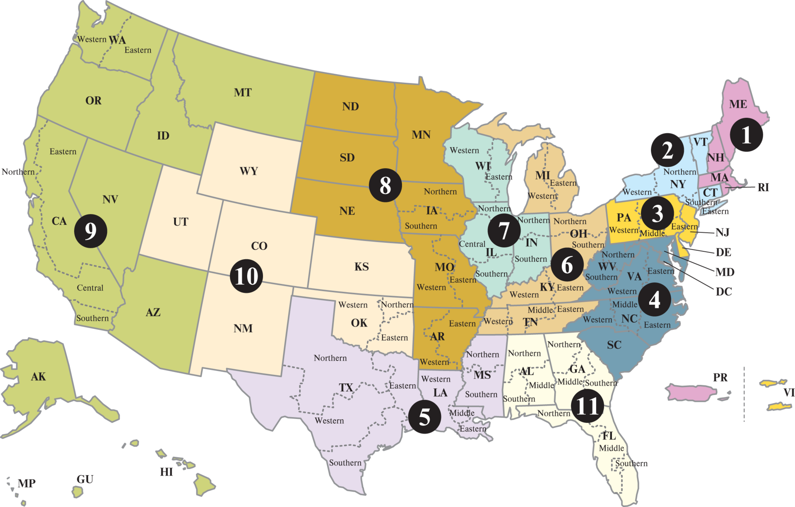
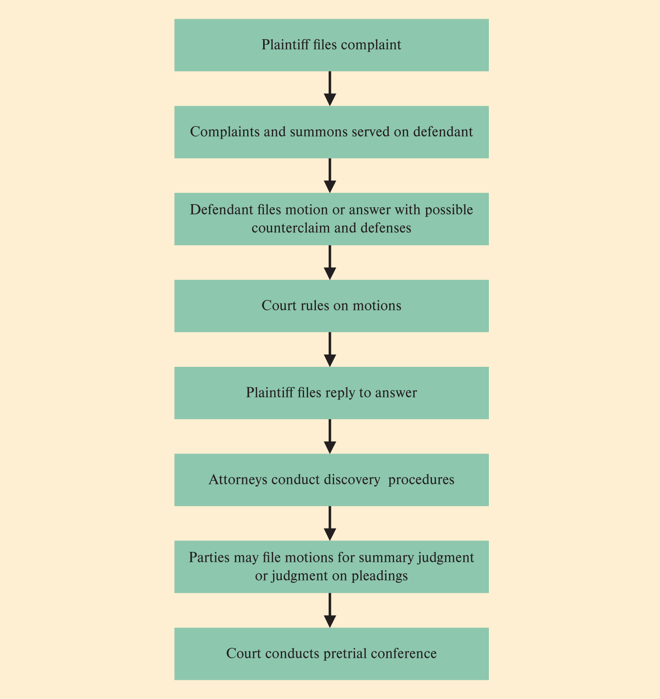
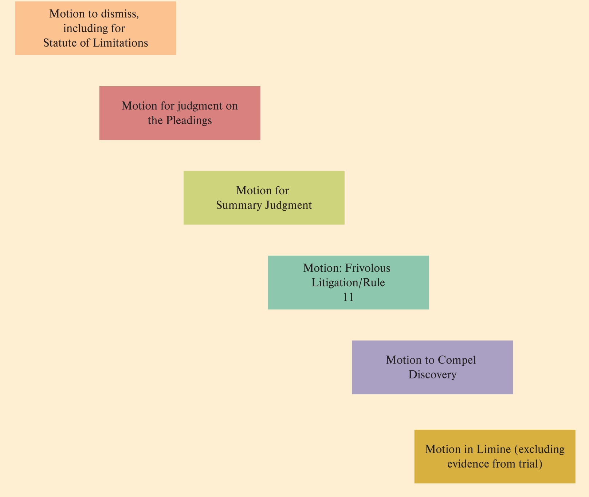
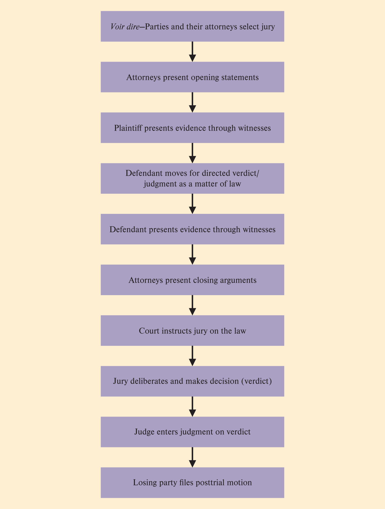
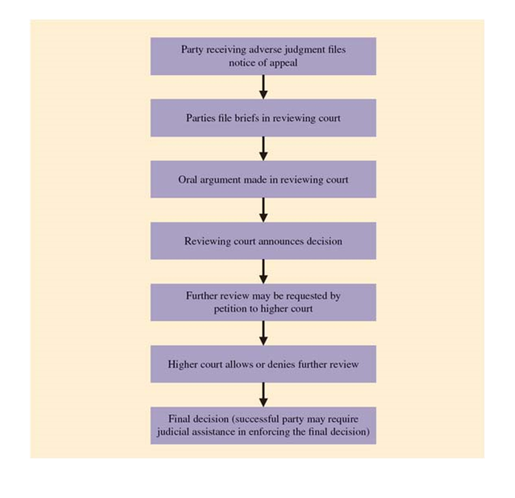

# Business Law
- [Business Law](#business-law)
  - [Syllabus / Intoductory notes](#syllabus--intoductory-notes)
- [Chapter 1 Law as a foundation for Business](#chapter-1-law-as-a-foundation-for-business)
        - [PP online, linked here \<-](#pp-online-linked-here--)
  - [Companies in the US must:](#companies-in-the-us-must)
  - [What is law](#what-is-law)
  - [Rule of Law](#rule-of-law)
  - [Property (ownership)](#property-ownership)
  - [Jurisprudence](#jurisprudence)
  - [Classification of Law](#classification-of-law)
      - [Common  \& Civil](#common---civil)
      - [Public \& Private](#public--private)
      - [Civil \& Criminal](#civil--criminal)
  - [Substantive Law and Procedural Law](#substantive-law-and-procedural-law)
  - [Federal Law](#federal-law)
  - [State Law - ordered top to bottom, most authorative to least.](#state-law---ordered-top-to-bottom-most-authorative-to-least)
  - [Judicial Decisions or Case law](#judicial-decisions-or-case-law)
      - [Hierarchy of Sources of Law](#hierarchy-of-sources-of-law)
  - [Legal Sanctions](#legal-sanctions)
  - [Sanctions for criminal conduct](#sanctions-for-criminal-conduct)
  - [Tortios Conduct](#tortios-conduct)
  - [Sanctions for breach of contract](#sanctions-for-breach-of-contract)
  - [Corporations](#corporations)
  - [Specific sense of Corporate governance](#specific-sense-of-corporate-governance)
- [Chapter 2 Ethics](#chapter-2-ethics)
  - [Contemporary Business Ethics](#contemporary-business-ethics)
  - [Ethics and Morality](#ethics-and-morality)
  - [Ethics and Law](#ethics-and-law)
  - [Systems of Ethics:](#systems-of-ethics)
  - [Sources of value for business ethics](#sources-of-value-for-business-ethics)
  - [Legal regulation - Ethical rules drawn from the law](#legal-regulation---ethical-rules-drawn-from-the-law)
  - [Professional code of ethics](#professional-code-of-ethics)
  - [Organizational code of ethics](#organizational-code-of-ethics)
  - [Individual Values](#individual-values)
    - [Individual values: Self Examination:](#individual-values-self-examination)
- [Chapter 3 - The Court System](#chapter-3---the-court-system)
  - [Key Terms:](#key-terms)
  - [Judges and Justices](#judges-and-justices)
  - [Jurors](#jurors)
    - [Jurors contd...](#jurors-contd)
  - [Lawyers](#lawyers)
  - [Organization of the court system](#organization-of-the-court-system)
  - [Subject matter jurisdiction](#subject-matter-jurisdiction)
  - [Federal courts review:](#federal-courts-review)
  - [Diversity of citizenship](#diversity-of-citizenship)
  - [Federal Question cases:](#federal-question-cases)
  - [District courts](#district-courts)
  - [Appellate courts](#appellate-courts)
  - [Decisions by the US Supreme Court.](#decisions-by-the-us-supreme-court)
          - [Source: SCOTUSblog Stat Pack, October Term 2018. https://www.scotusblog.com/wp-content/uploads/2019/07/StatPack\_OT18-7\_30\_19.pdf](#source-scotusblog-stat-pack-october-term-2018-httpswwwscotusblogcomwp-contentuploads201907statpack_ot18-7_30_19pdf)
  - [Power of judical review.](#power-of-judical-review)
    - [US Supreme court has the ultimate power to invalidate actions by the President or Congress.](#us-supreme-court-has-the-ultimate-power-to-invalidate-actions-by-the-president-or-congress)
  - [Judical restraint:](#judical-restraint)
  - [Judicial activism](#judicial-activism)
  - [Nature of the judical process](#nature-of-the-judical-process)
  - [Review Questions and Problems](#review-questions-and-problems)
    - [Personnel](#personnel)
    - [Organization of the Court System](#organization-of-the-court-system-1)
    - [The Power of Judicial Review](#the-power-of-judicial-review)
    - [business discussions](#business-discussions)
  - [Exam 1 Review:](#exam-1-review)
- [Chapter 4](#chapter-4)
          - [Exam 1 Due Tonight 9/19 by 11:59pm](#exam-1-due-tonight-919-by-1159pm)
  - [Litigation](#litigation)
  - [Parties](#parties)
  - [Standing to sue](#standing-to-sue)
    - [Personal Jurisdiction](#personal-jurisdiction)
  - [Class-Action Suits:](#class-action-suits)
    - [Pretrial procedures](#pretrial-procedures)
  - [Pleadings](#pleadings)
  - [Discovery](#discovery)
  - [Discovery methods](#discovery-methods)
  - [Discovery scope](#discovery-scope)
  - [Motions](#motions)
- [The Trial](#the-trial)
  - [Food for thought...](#food-for-thought)
  - [Jury Selection](#jury-selection)
    - [Case 4.2](#case-42)
      - [Supreme court outlawed racial discrimination in peremptory challenges](#supreme-court-outlawed-racial-discrimination-in-peremptory-challenges)
      - [Gender discrimination is bannedd in the jury selection process](#gender-discrimination-is-bannedd-in-the-jury-selection-process)
  - [Other Steps in a Trial](#other-steps-in-a-trial)
  - [Opening statements](#opening-statements)
  - [Burden of Proof](#burden-of-proof)
  - [Deciding the case](#deciding-the-case)
- [Post trial issues](#post-trial-issues)
        - [If you are found not guilty in criminal case: the opposing party (the government) Cannot appeal the case.  Where as if the criminal loses the case, he can appeal. To be tried again would result in double jeapordy](#if-you-are-found-not-guilty-in-criminal-case-the-opposing-party-the-government-cannot-appeal-the-case--where-as-if-the-criminal-loses-the-case-he-can-appeal-to-be-tried-again-would-result-in-double-jeapordy)
  - [Appellant Procedures](#appellant-procedures)
  - [Appellate Procedures](#appellate-procedures)
  - [Appellate Review:](#appellate-review)
  - [Enforcement of judgments and decrees](#enforcement-of-judgments-and-decrees)
  - [*Res Judicata*](#res-judicata)
- [Chapter 5 - Alternative Dispute Resolution](#chapter-5---alternative-dispute-resolution)
  - [Negotiation](#negotiation)
  - [Positional Negotiation](#positional-negotiation)
  - [Principled Negotiation](#principled-negotiation)
  - [Alternative dispute resolution systems (ADR Systems)](#alternative-dispute-resolution-systems-adr-systems)
  - [Fig. 5.1 Scale of dispute resolution systems.](#fig-51-scale-of-dispute-resolution-systems)
  - [Arbitration](#arbitration)
  - [Submission](#submission)
  - [Factors that influence the selection of Arbitrators](#factors-that-influence-the-selection-of-arbitrators)
  - [Case 5.1 Arbitrators Authority](#case-51-arbitrators-authority)
  - [Awards.](#awards)
  - [Federal Arbitration Act](#federal-arbitration-act)
  - [Case 5.2](#case-52)
  - [Statutorily Mandated Arbitration](#statutorily-mandated-arbitration)
- [Chapter 6 The Constitution](#chapter-6-the-constitution)
  - [The First 14 Amendments](#the-first-14-amendments)
  - [Basic Concepts of the Constitution](#basic-concepts-of-the-constitution)
  - [The Commerce Clause](#the-commerce-clause)
  - [Amendments and Basic Protections](#amendments-and-basic-protections)
  - [First Amendment Protections](#first-amendment-protections)
  - [Second Amendment: The right to Possess guns](#second-amendment-the-right-to-possess-guns)
  - [Fifth amendment: Takings Clause](#fifth-amendment-takings-clause)
  - [Fourteenth AMendment: Equal Protection and Due Process of Law](#fourteenth-amendment-equal-protection-and-due-process-of-law)
- [Chapter 7: Property Rights](#chapter-7-property-rights)
  - [Problem of limited resources:](#problem-of-limited-resources)
  - [Property is essential to society acheiving prosperity](#property-is-essential-to-society-acheiving-prosperity)
  - [Divisions of property](#divisions-of-property)
  - [Types of ownership](#types-of-ownership)
  - [Easements](#easements)
  - [Bailments](#bailments)
    - [Case 7.2 Bailment:](#case-72-bailment)
  - [Acquiring resources](#acquiring-resources)
  - [Adverse Possession](#adverse-possession)
  - [Acquiring resources through gift.](#acquiring-resources-through-gift)
  - [Title and Property Registration](#title-and-property-registration)
  - [Security interests in Land](#security-interests-in-land)
  - [Secured Transactions](#secured-transactions)
  - [Nuisance and Zoning](#nuisance-and-zoning)
  - [Duration limitations on property](#duration-limitations-on-property)
    - [Inclass bonus Notes:](#inclass-bonus-notes)
- [Chapter 8 Contract formation](#chapter-8-contract-formation)
  - [Contracts](#contracts)
  - [Sources of contract law](#sources-of-contract-law)
  - [Classification of contracts](#classification-of-contracts)
    - [Contract words to know: :](#contract-words-to-know-)
  - [Requirements for enforceable contract](#requirements-for-enforceable-contract)
  - [Defenses to Enforcementj](#defenses-to-enforcementj)
  - [Offer](#offer)
  - [Offer termination](#offer-termination)
  - [Acceptance](#acceptance)
  - [Consideration](#consideration)
  - [Capacity of Parties](#capacity-of-parties)
  - [Lawful Purpose](#lawful-purpose)
          - [Covenanats not to competete: Protects employers from having the employees they train leave them and compete against them.](#covenanats-not-to-competete-protects-employers-from-having-the-employees-they-train-leave-them-and-compete-against-them)
  - [Another legit excuse](#another-legit-excuse)
  - [Other ways out](#other-ways-out)
  - [Breach of Contract](#breach-of-contract)
  - [Remedies for Breach of Contract](#remedies-for-breach-of-contract)
  - [So there's another way out of a contract?](#so-theres-another-way-out-of-a-contract)
- [Chapter 9 Torts](#chapter-9-torts)
  - [Categories of Torts](#categories-of-torts)
  - [Interference with business relations](#interference-with-business-relations)
  - [Negligence](#negligence)
          - [Consumer protection: flashcards reccommended; not interesting stuffs, more than likely to be on homework and tests cause there's tons of laws and neuances](#consumer-protection-flashcards-reccommended-not-interesting-stuffs-more-than-likely-to-be-on-homework-and-tests-cause-theres-tons-of-laws-and-neuances)
  - [FTC Federal Trades Commission](#ftc-federal-trades-commission)
  - [TODO: add fig. 18.1, Consumer Protection Laws the FTC administers](#todo-add-fig-181-consumer-protection-laws-the-ftc-administers)
  - [FTC Penalties and Remedies](#ftc-penalties-and-remedies)
  - [FTC Today](#ftc-today)
  - [False Advertising - Determining Deception](#false-advertising---determining-deception)
  - [Consumer privacy - Limitations on Government Intrusions](#consumer-privacy---limitations-on-government-intrusions)
  - [Business Privacy](#business-privacy)
  - [Election and online privacy protection](#election-and-online-privacy-protection)
  - [Case 18.1 - Electronic and Online Privacy](#case-181---electronic-and-online-privacy)
  - [International Privacy Protection](#international-privacy-protection)
          - [review discrimination and it's varrying levels for final exam!](#review-discrimination-and-its-varrying-levels-for-final-exam)
  - [Equal Credit Opportunity Act (ECOA)](#equal-credit-opportunity-act-ecoa)
  - [Fair credit reporting act (FCRA)](#fair-credit-reporting-act-fcra)
  - [Fair and accurate credit transactions (FACT)](#fair-and-accurate-credit-transactions-fact)
  - [Truth-in-Lending Act:](#truth-in-lending-act)
  - [Fair debt collection practices act:](#fair-debt-collection-practices-act)
  - [Consumer financial protection act](#consumer-financial-protection-act)
  - [Bankruptcy](#bankruptcy)
  - [Additional statues for consumer portection](#additional-statues-for-consumer-portection)

## Syllabus / Intoductory notes
> 08/27/2019 

Course Materials (Text, calculator, etc.) Book: The Legal and Regulatory Environment of Business (with online McGraw Hill Connect), Seventeenth Addition, Pagnattaro, McGraw Hill Education. `ISBN 978-1-25-962174-1` Note: online access to McGraw Hill Connect is required. Regarding the textbook, you may purchase a hard copy or use the e-book version that comes with online Connect access.
Currently online registration is broken, fix tbd

1 HW per chapter, lowest HW is dropped. (Maybe up to 3?)
all Chapter HW is due Thursday. 

Extra credit: participate in a mini-skit

Exams are online, access for 48hrs.   
~~revised copy of syllabus incoming, exam that was due on thanksgiving will be moved.~~ =>
That exam is now opens the Thursday before thanksgiving (Nov 21)   
Class day before tests open will be used for review. 

# Chapter 1 Law as a foundation for Business
##### PP online, [linked here](https://buffswtamu-my.sharepoint.com/:b:/r/personal/wrchesley1_buffs_wtamu_edu/Documents/Fall%202019/Business%20Law/Week%201/Chap%201.pdf?csf=1&e=EZPOab) <-
## Companies in the US must: 
* aware of legal and regulatory landscape
* take steps to ensure full compliance w/diff regulatory laws (ie. sarbans-oakly)
* avoid civil and criminal liability
* Lawyers are useful

## What is law  
* Rules established by the state and backed by enforcement.   
* Formal social force  
* Why have it?   
    - To maintain order in society   
    
## Rule of Law 
- Laws are generally and equally applicable. To all memebers of society  
    > we like to believe lady justice is blind   
- Rule of law nations adopt laws supporting the private market. (argued Rule of law nations have higher GDP on average)  
- Judges play a viatal role in maintaining the rule of law.   

## Property (ownership)
Legal right that allows a person to exclude others from him/her resources. (from a water bottle to houses, intellectual property)  
Types of ownership:  
- public  
- private  
- common (France v. Britan Mussel Treaty? 2018? Link to be found...aparently theres YT videos too :) )   
- Exclusionary right of property - Basis for private markets and modern business.   
- Open source software  
    
## Jurisprudence
Philosophies that explain origin of law & it's justification  
- Legal Realism  
- Sociological  
- Historical science: Emphasizes that contemporary law should focus on legal principles that have withstood the test of time in a nation. 
    - Friedrich Savigny (German legal philosopher) Helped develop this school of Jurisprudence. 
- Positive law: (Legal Positivism) Beleives that law is simply the commands of the state backed up by force and punishments.   
- Natural Law: Law contains universal moral principles that are often observed in nature and we can determine them through human reason. 
    - John Looke (British Philosopher) his writings helped influence the framers of the US Constitution. He beleived that `Property` was a part of natural law. 
     
## Classification of Law
#### Common  & Civil 
- Common Law
    - Emphasizes the role of Judges in determining the meaning of laws
    - Related terms: Precedent
- Civil Law
    - Relies on legislation for law
    - Related terms: Statues / Statutory
 #### Public & Private
- Public: Regulation of society 
    - Constitutional Law ch.6
    - Administrative Law ch.15
    - Criminal Law
- Private Law: Covers legal problems and issues that concern private resource relationships
    - property law ch.7
    - contract law ch.8-9
    - Tort law ch.10
 #### Civil & Criminal
- Civil cases
    - Include suits for breach of contract or Tort cases. 
        - In a civl case it's `me v you` in criminal it's `me v the state` 
    - Involve request for damages or appropriate relief
- Criminal cases
    - a govt representative attempts to prove the wrong commited against society
    - Civil and criminal cases can overlap
    - result in punishment 

> 08/29/2019

## Substantive Law and Procedural Law  
Substantive Law - realationship of people with other people or with the state, ex. Property law  
Procedural Law - method and means by which Substantive law is made and administered.  ex. Rules of Evidentiary Procedure, administrative law  (machinery that enforces substative law)

## Federal Law
Constitution - top law of US -  
Legislation - 2nd -  
administrative law or regulations - last in list of authority for laws.  

## State Law - ordered top to bottom, most authorative to least. 
- State Constitution  
- Statutes or Acts  
- Regulatory law of state and administrative agencies  
- ordinances (county or city)  

## Judicial Decisions or Case law
- interpret Constitutional, Legislative and Regulatory laws
- opinions: decisions made by judges on legal issues. 
    - Becomes `precedents` for future cases involving similar facts and legal issues
    - Citation: address for locating the case in a library or a computer database. ex: `3 cai. R. 175, 2 Am. Dec. 264 (N.Y. 1805)` Translates to  Pierson v. Post (the Foxhunt case used as an example in class)  
- Advantages:  
    - Stare decisis 
        - Judges follow precedents whenever possible. 
        - Ensures certainty and predictability in the law
    - Specifies boundaries of Property-based legal system
- Disadvantages:  
    - Volume of cases  
    - Conflicting precedents  
    - **Conflicts of Law** 
    - Distinction between **holding** and **dicta** Increased difficutly of determining the precedent
      - Holding: What was necessary to the decision reached in a prior case
      - Dicta: What the court said other than what was necessary to reach the decision that was made.     
    - Rejection of precedent - Rare, but it can happen (*Constitutional Relativity vs Originalism*) 
> dicta is extra stuff in a case that is not holding  
Holding can set precedents, dicta does not  

       

#### Hierarchy of Sources of Law  
1. US Constitution and amendments    
2. Statues of Congress  
3. Federal administration regulation   
4.  State Constitutions   
5.  Statues Statues  
6. State administrative regulation  
7. Local ordinances   
8. case law  

## Legal Sanctions
- Used by law enforcement officials and courts
- to encourage and force compliance with the law [ie. speeding tickets.] 
- Remedy: 
    - Right of an individual
    - To take another persons resources. 
    - [slip and fall case - can sue for damages]
    - because that person failed to meet requirements of the law.  

## Sanctions for criminal conduct 
- Crime is public wrong against society
- Punishments   
    - death   
    - imprisonment  
    - fine  
    - removal  
    - disqualification  

## Tortios Conduct  
- Tort 
    - Civial wrong (other than breach of contract)
    - Intentional
    - Negligence
    - Strict liability  
- Remedies
    - Compensatory Damages (money) (compensation)
    - Punitive damages (exemplary damages)  punishment (ie. mcdonalds hot coffee case, they had 200 prev people report overheated coffee, they did nothing to fix it. Old lady had 3rd degree burns all over, had to have reconstructive surgery, she originally wanted only enough to cover her medical expenses. McDonald's offered like $800? something really small and ludicrous. This was taken before a jury who saught to punish McDonalds for their blatent misdeeds and awarded something like 3mill?  )

## Sanctions for breach of contract
- Breach of contract 
    - failure to perform contractual promise. 
- Remedies
    - Damages (money)
    - Compensatory 
    - Consequential 
    - Specific performance  

## Corporations 
- Businesses chartered by the state to do business as a legal person.  
- owned by shareholders. 
- Board of directors runs the business
- Managers are in charge of day-to-day business operations.  

## Specific sense of Corporate governance
- Legal relationship between 
    - coroporate agents & 
    - shareholders of the corporation 
- Value of corporations will be destroyed if managers abuse their control of resources for personal benefits.  

# Chapter 2 Ethics 

> The Role of Ethics in Decision Making & Business
> [PP Linked here](https://buffswtamu-my.sharepoint.com/:b:/r/personal/wrchesley1_buffs_wtamu_edu/Documents/Fall%202019/Business%20Law/Week%202/Chap%202%20[Compatibility%20Mode].pdf?csf=1&e=eUaeqK)  

## Contemporary Business Ethics
- Ethics officers
    - Develop ethics policies / code of ethics
    - Listen to complaints of ethics violations
    - Investigate ethics abuses 
- Sarbanes-Oxley Act (SOX) of 2002
    - Reaction to Enron and WorldComm scandles of early 2000's  
    - Established higher standareds for coroporate responsibility and governance. 
- "Good Faith" according to Uniform Commercial Code:
  - Honesty in intent
  - Honesty in fact
- "Good Faith" legal definition: in the case of a merchantmeans honesty in fact and the observance of reasonable commercial standards of fair dealing in the trade. <a href="https://www.law.cornell.edu/ucc/2/2-103">cornell.edu</a> 

## Ethics and Morality  
- Morality: Values that guide one's behavior   
- Ethics: formal system for deciding what's right and wrong  
- The good: Moral goals and objectives one choooses to pursue.  

## Ethics and Law
Fear Punishments vs. Want to do what's right 
- Society's ethical values may become law throught Legislation

> 09/03/2019

## Systems of Ethics: 
- **Formalism**: `affirms absolute Morality`
    - Duty based view, if you have a duty, do it!
    - Categorical Imperative  
    - Social Contract - Idea that we all kinda have a contract with eachother, ie. i have my rights but no right to 'step' on your rights  
- **Consequentialialism** - Concerned with moral *consequnces* of actions
    - Utilitarianism
    - Focuses on Common Good
    - Ethics of actions are measured by how they promote the common good
    - Protestant ethic
- **social contract theory** concerns itself with how to construct a just society given: the many inequalities of wealth, knowledge, and social status. Theory by John Rawls, has two main principles: 
  - Each person has the same and indefeasible [permanent] claim to a fully adequate scheme of equal basic liberties, which scheme is compatible with the same scheme of liberties for all.
  - Social and economic inequalities are to satisfy two conditions: 
    - first, they are to be attached to offices and positions open to all under conditions of fair equality of opportunity;
    - second, they are to be to the greatest benefit of the least-advantaged members of society (the Difference Principle). 
  - ref: [BRIA 23 3 c Justice as Fairness: John Rawls and His Theory of Justice](https://www.crf-usa.org/bill-of-rights-in-action/bria-23-3-c-justice-as-fairness-john-rawls-and-his-theory-of-justice)

Ethics influences legal system: Is there a relationship between law and ethics? Yes.  

## Sources of value for business ethics
- Legal regulation 
- Professional codes of Ethics - Professional code is career choice based ie. Internal Auditor
- Organizational codes of ethics - Publicly traded companies are required to have  code of ethics.  
- Individual values 

## Legal regulation - Ethical rules drawn from the law
- Respect liberty and rights of others. (ie. free speech, but cannot yell fire in crowded theatre)
- Act in good faith 
- Exercise due care
- avoid conflics of interest
- Honor confidentiality 

## Professional code of ethics
- Crtain professions have long traditions of codes of ethical conduct (CPA's have had a long standing code of ethics.)  
    - More recent professions have developed and adopted their own codes.   
- Ethical codes of organization are a form of *self regulation*.   

blockquote>
<em>sidebar 2.5</em>
<h3>American Marketing Association Statement of Ethics</h3>
<h4><strong>PREAMBLE</strong></h4>

The American Marketing Association commits itself to promoting the highest standard of professional ethical norms and values for its members (practitioners, academics and students). Norms are established standards of conduct that are expected and maintained by society and/or professional organizations. Values represent the collective conception of what communities find desirable, important and morally proper. Values also serve as the criteria for evaluating our own personal actions and the actions of others....  
<h4><strong>ETHICAL VALUES</strong></h4>

**Honesty** — to be forthright in dealings with customers and stakeholders. To this end, we will:

    Strive to be truthful in all situations and at all times.

    Offer products of value that do what we claim in our communications.

    Stand behind our products if they fail to deliver their claimed benefits.

    Honor our explicit and implicit commitments and promises.

**Responsibility** — to accept the consequences of our marketing decisions and strategies. To this end, we will:

    Strive to serve the needs of customers.

    Avoid using coercion with all stakeholders.

    Acknowledge the social obligations to stakeholders that come with increased marketing and economic power.

    Recognize our special commitments to vulnerable market segments such as children, seniors, the economically impoverished, market illiterates and others who may be substantially disadvantaged.

    Consider environmental stewardship in our decision-making.

**Fairness** — to balance justly the needs of the buyer with the interests of the seller. To this end, we will:

    Represent products in a clear way in selling, advertising and other forms of communication; this includes the avoidance of false, misleading and deceptive promotion.

    Reject manipulations and sales tactics that harm customer trust.

    Refuse to engage in price fixing, predatory pricing, price gouging or “bait-and-switch” tactics.

    Avoid knowing participation in conflicts of interest.

    Seek to protect the private information of customers, employees and partners.

**Respect** — to acknowledge the basic human dignity of all stakeholders. To this end, we will:

    Value individual differences and avoid stereotyping customers or depicting demographic groups (e.g., gender, race, sexual orientation) in a negative or dehumanizing way.

    Listen to the needs of customers and make all reasonable efforts to monitor and improve their satisfaction on an ongoing basis.

    Make every effort to understand and respectfully treat buyers, suppliers, intermediaries and distributors from all cultures.

    Acknowledge the contributions of others, such as consultants, employees and coworkers, to marketing endeavors.

    Treat everyone, including our competitors, as we would wish to be treated.

**Transparency** — to create a spirit of openness in marketing operations. To this end, we will:

    Strive to communicate clearly with all constituencies.

    Accept constructive criticism from customers and other stakeholders.

    Explain and take appropriate action regarding significant product or service risks, component substitutions or other foreseeable eventualities that could affect customers or their perception of the purchase decision.

    Disclose list prices and terms of financing as well as available price deals and adjustments.

**Citizenship**— to fulfill the economic, legal, philanthropic and societal responsibilities that serve stakeholders. To this end, we will:

    Strive to protect the ecological environment in the execution of marketing campaigns.

    Give back to the community through volunteerism and charitable donations.

    Contribute to the overall betterment of marketing and its reputation.

    Urge supply chain members to ensure that trade is fair for all participants, including producers in developing countries.

<em>sidebar 2.6</em>
<h3>American Institute of Certified Public Accountants Code of Professional Conduct</h3>

The Principles call for an unswerving commitment to honorable behavior, even at the sacrifice of personal advantage.

In carrying out their responsibilities as professionals, members should exercise sensitive professional and moral judgments in all their activities.

As professionals, members perform an essential role in society. Consistent with that role, members ... have responsibilities to all those who use their professional services. Members also have a continuing responsibility to cooperate with each other to improve the art of accounting, maintain the public’s confidence, and carry out the profession’s special responsibilities for self-governance. The collective efforts of all members are required to maintain and enhance the traditions of the profession.

Members should accept the obligation to act in a way that will serve the public interest, honor the public interest, and demonstrate commitment to professionalism.
</blockquote>

## Organizational code of ethics
* Business have adopted ethical codes at the individual organizational level
* More important than creating a code:  
    * Effective implementation!  
    * Enforcement - consistency is key!  
## Individual Values
The ultimate source of ethics for business decision making comes from the individual. Others can tell you what is right or wrong. They can sanction you for failing to live up to their expectations. But only you can develop an ethical mindset. Only you can intend your actions to be honest and fair or to serve the common good.  
* Have I thought about whether the action I may take is right or wrong?
* Will I be proud to tell of my action to my family? To my employer? To the news media?
* Am I willing for everyone to act as I am thinking of acting?
* Will my decision cause harm to others or to the environment?
* Will my actions violate the law?

### Individual values: Self Examination:  
>  
Should I do it?
* Is it right or wrong? 
* WIll I be proud if they found out
* How would I feel if everyone did it? 
* Will it cause harm? 
* Is it legal?   

Obstacles: 
* Profits vs. Ethics
* Group think - if everyone else is doing it...might as well...mob mentality
    * Individuals feel less responsible if the whole group is doing it.   
* Control of resources by non-owners (potential conflics of interest)
    * Managerial agents can manipulate resoures in their own interest. 
    * Self-dealing

Promoting  Business Ethics 
* Involve top management - have to have this, CEO as role model, rest of comapnay should follow suit 
    * Role model
    * Tone from the top
    * *Must believe in the expressed values*
* Open communication / Transparency
    * promotes trust  
    * Required due to complexity of information  
* Consideration of stakeholders
    * stakeholder Theory: Directors and managers must take into account it's stakeholders whose interests the corporations impacts. 
* Be Consistency! 

> Can an act be ethical but not legal?  Yes
This happens sometimes when American companies go overseas  

Can a business have a conscience?
* Personhood rights of a corporation have been recognized in the law. 
    * Corporation is an individual
* Does this mean that a corporation can have values and all the individual employees must agree with them? 
* What about laws for corporations that force individuals to violate religious values? 

# Chapter 3 - The Court System

> Created: 09/03/2019  
> Updated:  02/05/2023

## Key Terms: 
* Appeal - The right of litigation parties to have the legal decisions of the trial judge reviewed by an appellate court. 
* Apellate Court - A court that decides wheter a trial judge has made a mistake of law. 
* Court of Appeals - A court that reviews decisions (made) by lower courts. 
* 

## Judges and Justices
* two terms are not synonomous
* individuals who operate the courts
* Trial Court  
    * Judges  
    * Determines the rules of law for a case   
    * REnders decisions that deal directly with people in conflict
    * primary duty to observe and apply constitutional limiatations and garuntees.
    * uphold dignity of the courts and maintain respect for the law.  
* Appellate Court
    * Justices  
    * Review case (as if they are grading papers from the judges)  
    * apeals courts do not have jury, one or more Justice will decide the case. Some attornies will specialize in Appellate cases  
    * decide an appeal and provide reasons for their decisions.  
    * immunity from legal actions against them based on their judicial acts  

## Jurors
* Fact-finding body
* Trial by jury is guaranteed by the Bill of Rights. 

> 09/05/2019  

### Jurors contd...   
* Petit Jury: Trial jury that returns a verdict in criminal and civil stiuations. (usually 12 people, civil might have 6, varies between states/counties)  
* Decisions must be unanimous (called hung if it's not a unanimous decision)  
    * leads to mistrial where prosicution can retry the case if they want to.  
    * don't have to provide reasons for guilt/innocence 

## Lawyers  
* Primary duty is to the administration of Justice. 
* Present: 
    * Evidence
    * Points of law (they think judge/court should focus on)
* Make arguments
* Assist juries and judge in making decisions (jury: what facts are true? Judge: What laws are relevent?)
* Serve as counsellors, advocates, and public servants. 
* Serve as representative advocates in court system
* confidential communications with clients (client attorny privilege)
    * rules of Evidence
    * attorney-client privilege   
        * forbids a Lawyer to reveal confidential facts and testify against a client. 
    * work product doctrine
        * protects some documents of expert witnesses (drafts)

## Organization of the court system

1. Supreme court  
2. Appellate courts. 
3. Trial courts.  

> Is the state supreme court always the highest court in that state. 
No. not always! Sometimes they have a different name or appeal system. 
Texas has seperate courts for criminal and civil courts.   

## Subject matter jurisdiction
* Power over the case issues. 
* jurisdiction can be limited to: 
    * A specific subject matter
    * area in which the party lives (some areas with large and diverse populations will have static probate judges (specialize in wills/guardianship))  
* Examples: 
    * Probate courts: Wills and estates
    * Traffic courts: Traffic violations 

Fig. 3.1 - *State Court System*  
 
> *Term to know: Centori: a writ or order by which a higher court reviews a decision of a lower court.*

## Federal courts review: 
1. if the US is involved as a party 
2. state vs. state 
3. Citizens of different states (ammount in controversy(ie. amounts greater than $75K), diversity of citizenship)  
4. Law: Federal Question 

Fig. 3.2 - *The Federal Court System*  
  

> Federal Courts have subject matter jurisdiction over federal question cases and diversity of citizenship cases. 

## Diversity of citizenship 
* Diversity 
    * Plaintifs / defendants are citizens of different states. 
    * To reach federal court: each claim must be $75K+ 
    * guard against state court bias.  

## Federal Question cases: 
* US Constitution issues ie. (Miranda vs. Arizona => Miranda rights)
* MOTHER FUCKING *ROE V. WADE*
* Federal Statue issues
* no $$$ limits.  

> Small-Claims Courts  
> - Entrepreneurs are well advised to be aware of the small-claims court as an effective place to resolve matters that do not involve large amounts of money.
> - The dollar limit jurisdiction of the courts varies by state from approximately $2,500 to $25,000. Small-claims courts have low court costs and simplified procedures. The informality of the proceedings speeds up the flow of cases. The services of a lawyer are not usually required, and some states do not allow lawyers to participate in these proceedings. Typical cases: 
> - clients who fail to pay;
> -    disputes with vendors;
> -    landlord-tenant problems, including security deposits;
> -    damage to clothing caused by cleaners or alterations;
> -    relatively minor personal injuries (e.g., dog bites);
> -    issues with contractors;
> -    failure to repair a vehicle or appliance properly.  
> The following claims *cannot* be brought in small claims courts: **divorce, guardianship, name change, bankruptcy, or actions for emergency relief (injunctions).**

## District courts
* Trial courts of the federal system. 
* One court in every state and the Distric of Colombia. 
* *Federal Rules of Civil Procedure:* Provide the details concerning procedures to be followed in federal court litigation. 

## Appellate courts
~~TODO: Get Geographical boundries for Appellate courts.~~  
> Fig 3.3 *The Federal Court of Appeals  

* 12 courts of appeal
* Special court of appeals hears appeals from 
    * special courts. 
    * Administrative decisions
* Other courts have been created to handle the special subject matter.
    * Court of appeals for armed forces. 
* Texas is in the 5th circuit for court of appeals (apparently we rival the 9th district? (california - west coast?))

> General role of an appelate court is to: 
    Review questions of law. 

## Decisions by the US Supreme Court. 
*SCOTUS:* Supreme court of the united states.  
* review requires a petition for a *writ of Certiorari*
    * writ is submitted by losing party in court of appeals for permission to file an appeal with the US Supreme Court.
    * Supreme Court can decide if it wants to grant the writ, it's not a right, typicaly granted in cases of substantial federal importance.  
* Supreme court resolves 
    * cases involving major Constitutional issues 
    * interpretation of federal law. 
* Final judgments of hightes state court are reviewed only by SCOTUS. 

> Sidebar 3.4 *Circuit Scorcard (2015-1016)*

| Circuit  | Number of Cases | % Decided | % Aff'D | % Rev'D | 
|---|---|---|---|---|
CA1 |	2| 	3%  	3| 	50% | 	50% |
CA2 |	5 | 	7% 	5 |	40% |	60% |
CA3 |	3 |	4% 	3 |	33% |	67% |
CA4 |	4 |	5% 	4 |	50% |	50% |
CA5 |	4 |	5% 	4 |	50% |	50% |
CA6 |	7 |	9% 	7 |	57.1% |	42.9% |
CA7 |	1 |	1 	 1 |	— |	100% |
CA8 |	4 |	5% 	 4 |	24% |	75% |
CA9 |	14 	| 19% 	14 |	14.3% |	85.7% |
CA10 |	2 |	4% 	 2 |	50% |	50% |
CA11 |	7 |	9% 	 7 |	57.1% |	42.9% |
CA DC |	3 |	4% 	 3 |	66.7% |	33.3% |
CA Fed |	4 	5% | 	4 |	50% |	50% |
State |	11 	| 15% 	 11 |	18% |	82% |
Dist. Ct |	3 |	4% 	 3 |	33.3% |	66.8% |
Original |	0 |	0% 	 - |	- |	- |
###### Source: SCOTUSblog Stat Pack, October Term 2018. https://www.scotusblog.com/wp-content/uploads/2019/07/StatPack_OT18-7_30_19.pdf

## Power of judical review. 
* The power of the courts in the United States to review laws passed by the legislative body and to declare them to be unconstitutional and void is known as *Judicial Review*.
* Judicial restraint vs. judical activism
* power should not be used except in unusual cases (restraint) vs. Power should be used when the needs of society justify it (activism). 
### US Supreme court has the ultimate power to invalidate actions by the President or Congress. 

>Judicial Restraint and Judicial Activism are not exclusive to a particular Judge. Many Judges may share aspects of both in their judicial philosophy. 

## Judical restraint: 
* Courts have a limited role. 
* conservative 
* Pragmatic approach to litigation.
* Societal changes through polical process rather than from court action 
* synonomous with: *Strict constructionism* or *judicial abstention*

## Judicial activism
* Liberal
* Courts have expansive role
* Policy directed / Result concious 
* Value oriented. 
* precedent  

> Sidebar 3.9 provides insight into the general alignment of the justices. It is important to understand, however, that this overall perspective does not translate into predictability. It is often fascinating to analyze each justice’s position as set forth in concurring and dissenting opinions.  

**Typical Alignment of Justices**  
|LEFT | 	SWING |	RIGHT |
|---|---|---| 
| Ginsburg |	Roberts |	Alito |
| Breyer 	|	| Thomas  |
| Sotomayor |	 | 	Gorsuch | 
| Kagan | | Kavanaugh |

## Nature of the judical process
1. Case to be decided. 
    * use existing statutes and precedents
    * create a law where none exist. 
    * Refusal to apply case law or find unconstitutional   
*Will ruling provide justice and a sound precedent?*  

~~Look at case 3.1 in book: Sebelius case regarding affordable care act.~~  
Case 3.1 was updated, see [Iancu v Brunetti](Cases/Case3.1_Iancu-v-Brunetti.md).  

## Review Questions and Problems
### Personnel

1. Judges and Justices What are the essential responsibilities of a trial judge?

2. Jurors Why have several states eliminated the requirement of unanimity in jury trials?

3. Lawyers Name the three critical roles a lawyer serves in society. Why have many lawyers and their business clients had such conflict in recent years?

### Organization of the Court System

1. *Subject Matter Jurisdiction*
    *  Mark, a citizen of Georgia, was crossing a street in Atlanta when he was struck by a car driven by David, a citizen of New York visiting Atlanta. The car was owned by David’s employer, a Delaware corporation that has its principal place of business in Atlanta, Georgia. Mark sues both David and the corporation in federal district court in Atlanta alleging damages in the amount of $500,000. Does the court have subject matter jurisdiction? Why or why not?

2. *State Courts*
    *  What role do reviewing or appellate courts play in the judicial process? How do they differ from trial courts?

3. *Federal Courts*
    *  XYZ makes and markets a product that it believes will help control weight by blocking the human body’s digestion of starch. The Food and Drug Administration (FDA) has classified the product as a drug and orders it removed from the market until it can evaluate its use through testing. XYZ disputes the FDA’s action and seeks to bring suit in the federal courts. Will the federal courts have jurisdiction to hear the case? Why or why not?

4. *Decisions by the U.S* 
    * Supreme Court Susan files a petition for certiorari in the U.S. Supreme Court following an adverse decision in the Illinois Supreme Court on a claim arising under a breach of contract. What chance does Susan have of the Supreme Court granting the petition? What special circumstances would she need to show?

### The Power of Judicial Review

1. *Judicial Restraint* 
    * Define the power of judicial review. How do advocates of judicial restraint exercise that power?

2. *Judicial Activism* 
    * Define judicial activism. Compare and contrast judicial restraint and judicial activism.

3. *A Sample U.S. Supreme Court Case*
    *  Why are concurring and dissenting opinions important?

4. *The Nature of the Judicial Process*
    *  What are the forces that Justice Cardozo says shape the judicial process? How is the law made? In light of the liberal versus conservative divisions in the courts, are Cardozo’s observations still relevant?

### business discussions

1. You have spent the past four weeks away from work serving as a juror in a case deciding whether a pharmaceutical company should be held liable for the heart attack of a woman who took its painkiller, Oxxy-1. The lengthy case has taken a toll on your professional career, and you have many unanswered questions as jury deliberations begin.

    * Where does your duty lie in serving on a jury?

    * Are you protected against adverse employment action by your firm for missing work to serve on a jury?

    * How do you reconcile the woman’s prior heart palpitations from years ago with her recent attack? Was her heart already compromised before she began taking the painkiller Oxxy-1?

    * Why didn’t the pharmaceutical company withdraw the painkiller from the market at the first sign of a problem?

2. You are the president of a large corporation that is in the business of manufacturing, among other things, chemical products used to eradicate termites. You have just reviewed a confidential report, prepared by one of your top scientists, questioning the effectiveness of the product and the claims your business has been making to homeowners, pesticide treatment firms, and the general public. You have heard rumors that a lawsuit will be filed shortly against your corporation claiming that this product is ineffective.

    * Who should you turn to for advice?

    * Should you destroy the report?

   * In which court can a lawsuit be filed?

    * If you lose the lawsuit at trial, can you appeal?

---

TODO: Add Ch 6 Notes - link Power point - Ch 1-6 Test Opens 9/17 - homework is best source of review, lots of overlap in question bank
[Chapter 6 PowerPoint](https://buffswtamu-my.sharepoint.com/:b:/g/personal/wrchesley1_buffs_wtamu_edu/EY2_ZuxswHhCpKPj87c3zeIBP8VDpyIx2PeyF0KMJBSQMw?email=chesley.walker%40gmail.com&e=8zMTGr)

---

## Exam 1 Review: 
lawyers first duty is administration of justice  
commercial speech is protected under first amendment; govt can limit it; and it may not be as extensive as right of individual  
under a minimum rationality approach a permissible state end is a legit goal of government.   
10th amendment reinforces federalism  
libel cases deal with printed defamatory falsehoods - tabloid magazines?  or slander (spoken defaming word)  
small claims courts do not require the services of a lawyer - think judge judy - not formal at all - limited by $$ amount asked for in claims  
lawyer is often involved in personal decision of clients  
judicial abstention; aka strict constructivism  

---

> 09/19/2019  

# Chapter 4  
###### Exam 1 Due Tonight 9/19 by 11:59pm
[PowerPoint here](https://buffswtamu-my.sharepoint.com/:b:/g/personal/wrchesley1_buffs_wtamu_edu/EWaskRa2XXNJobt0mhntZhoBDthfzjU_Qrm2fzhafbbFkg?email=chesley.walker%40gmail.com&e=Ca1Uaf)

## Litigation

Not the only way legal disputes are settled, there's also ADR (alternative dispute resolution) -> Ch. 5

attornies that are really good in court room are called litigators or Trial attornies. 

Litigation helps the business community resolve actual disputes. (lawsuits)  
Lawsuits are a drain
- time
- money
- energy 
End goal of lecture: develop and understanding of litigation process.  

## Parties
- Plantiff 
    - Person who filed the suit. 
    - a **civil** action 
- defendant
    - Party being sued or 
    - Person against whom a criminal charge is filed by the state
- 3rd-Party Defendant: 
    - Brought in by the defendant
    - to complete determination of a controversy 

## Standing to sue
Do you really have a "dog" in this fight? 
- Entitled to have the court decide the dispute
- To Establish a standing, plaintiff must allege: 
    - Litigation involves a case or controversy 
    - Personal stake in the resolution of the controversy

> Case 4.1  
*Mayer v. Belichick*
605 F.3d 223 (3rd Cir.)
Issue: 
- Videotaping the new york jets coaches and players on the field. 
- Purpose: capturing and stealing the new yourk jets signals and visual coaching instructions
 - The New England Patriots. 

**Updated Case 4.1 - 2023**
>*JULIANA v. UNITED STATES* F.3d (9th Cir. 2020)  
The panel reversed the district court's interlocutory orders in this action which was brought by 21 individual plaintiffs (all young citizens) and environmental organizations against the federal government alleging climate-change related injuries caused by the federal government continuing to "permit, authorize, and subsidize" fossil fuel.JULIANA v. UNITED STATES F.3d (9th Cir. 2020)  
The panel reversed the district court's interlocutory orders in this action which was brought by 21 individual plaintiffs (all young citizens) and environmental organizations against the federal government alleging climate-change related injuries caused by the federal government continuing to "permit, authorize, and subsidize" fossil fuel.  
***COWEN, Circuit Judge***  
In the mid-1960s, a popular song warned that we were "on the eve of destruction." (Barry McGuire, "Eve of Destruction," on Eve of Destruction, Dunhill Records, 1965.) The plaintiffs in this case have presented compelling evidence that climate change has brought that eve nearer. A substantial evidentiary record documents that the federal government has long promoted fossil fuel use despite knowledge that it can cause catastrophic climate change, and that failure to change existing policy may hasten an environmental apocalypse.  
The plaintiffs claim that the government has violated their constitutional rights, including a claimed right under the Due Process Clause of the Fifth Amendment to a "climate system capable of sustaining human life." The central issue before us is whether, even assuming such a broad constitutional claim exists, an Article III court can provide plaintiffs with the redress they seek--an order requiring the government to develop a plan to "phase out fossil fuel emissions and draw down excess atmospheric CO2." Reluctantly, we conclude that such relief is beyond our constitutional power. Rather, the plaintiffs' impressive case for redress must be presented to the political branches of government.  
The district court denied the government's motion to dismiss, concluding that the plaintiffs had standing to sue, raised justiciable questions, and stated a claim for infringement of a Fifth Amendment due process right to a "climate system capable of sustaining human life." The court defined that right as one to be free from catastrophic climate change that "will cause human deaths, shorten lifespans, result in widespread damage to property, threaten food sources, and dramatically alter the planet's ecosystem." The court also concluded that the plaintiffs had stated a viable "danger-creation due process claim" arising from the government's failure to regulate third-party emissions. Finally, the court held that the plaintiffs had stated a public trust claim grounded in the Fifth and Ninth Amendments. . . .  
The government . . . argues that the plaintiffs lack Article III standing to pursue their constitutional claims. To have standing under Article III, a plaintiff must have (1) a concrete and particularized injury that (2) is caused by the challenged conduct and (3) is likely redressable by a favorable judicial decision. . . .  
[After expressing skepticism that the first redressability prong is satisfied, the court stated] even assuming that it is, the plaintiffs do not surmount the remaining hurdle--establishing that the specific relief they seek is within the power of an Article III court. There is much to recommend the adoption of a comprehensive scheme to decrease fossil fuel emissions and combat climate change, both as a policy matter and in general and a matter of national survival in particular. But it is beyond the power of an Article III court to order, design, supervise, or implement the plaintiffs' requested remedial plan. . . .  
The plaintiffs have made a compelling case that action is needed; it will be increasingly difficult in light of that record for the political branches to deny that climate change is occurring, that the government had a role in causing it, and that our elected officials have a moral responsibility to seek solutions. We do not dispute that the broad judicial relief that plaintiffs seek could well goad the political branches to action. . . . We reluctantly conclude, however, that the plaintiffs' case must be made to the political branches or to the electorate at large, thee latter of which can change the composition of the political branches through the ballot box. That the other branches may have abdicated their responsibility to remediate the problem does not confer on Article III courts, no matter how well-intentioned, the ability to step into their shoes. . . .  
* Note: On March 3, 2020, the plaintiffs filed a petition for rehearing, asking the Ninth Circuit to hear the matter *en banc*. 

KEY POINTS to Case 4.1(2023) 
- To maintain a lawsuit, a plaintiff must have standing or a legally cognizable claim and the court must have the authority to hear the matter.
- The Ninth Circuit found that the court lacked Article III standing.
- Accordingly, the case was remanded with instructions to dismiss the case for lack of Article III standing.

 ### Personal Jurisdiction
 Court must have legal authority over an individual.  
 Court has to have authority over the parties in the case.  
 > No case can proceed forward without the existence of both subject matter and personal jurisdiction.
 - *in personum* over the person
    - Personal jurisdiction over the defendant obainted by: 
        - court summons
        - Service of Process 
 - *in rem?*
 - Long arm statuetes: Provision for the service of process beyond the boundaries of the state. Typical requirements for a long-arm statute are:
   - Has committed a tort within the state.
   - Owns property within the state that is the subject matter of the lawsuit.
   - Has entered into a contract within the state or transacted the business that is the subject matter of the lawsuit within the state.

## Class-Action Suits: 

Many people affected by an incident (red bull didn't give us all wings!)
- One or more plaintiffs file suit on their own behalf and on behalf of all other persons who may have a similar claim. 
- No one member of the class can make suing financially worthwhile (attornies typically take 1/3 of the reward in class action)

### Pretrial procedures

1. Plaintiff files complaint
2. Complaints and summons served on defendant
3. Defendant files motion or answer with possible counterclaim and defenses
4. Court rules on motions - case could be decided here and never make it to trial. 
5. Plaintiff files reply to answer. 
6. attornets conduct discovery procedures
7. Parties may file motions for summary judgment or judgement on pleadings 
8. Court conducts pretrial confrence. 

## Pleadings
- they are: 
    - Legal documents
    - filed with a court
    - begin litigation process
- complaint: filed by plaintiff
  - Contains allegations and relief saught from defendant
  - summons are delivered to defendant by court officer along with a copy of complaint.
- answer: filed by defendant
  - admints or denies each allegation made by plaintiff
  - may contain affirmative defenses that will defeat the plaintiff’s claim. 
  - The answer may also contain causes of action the defendant has against the plaintiff. These statements are called *counterclaims.*
- Default: order entered by court when defendant does not respond in any way. 
- After getting answer plaintiff must reply
    - Admits or denies each alligation of the defendants counterclaims 
> Complaint and Answer provide framework for lawsuit 

## Discovery 
Gather the Evidence
- Narrows the issues disputed by the parties. 
- Ensures results of lawsuits are based on the merits of the cotroversy. 
    - not an ability or skill of counsel 
- encourage settlement. 
- Get Evidence!!!! **<= THIS IS KEY!!**
> Do take advantage of the discovery process to learn as much as you can about the strengths and weaknesses of the case.

## Discovery methods
- Interrogatories: 
    - written questions (like written interview)
- Request for production of documents; 
    - Ask other party to produce specific documents
    - For example, a buyer of merchandise who is suing the seller can request that this defendant produce the original sales contract that contains certain warranties covering the merchandise. 
    - AKA the receipt. See Sidebar 4.7
- Depositions: 
    - Oral questions of the possible witness. 
    - asked by attornies, will have court reporter present, but witness is not under oath. trying to impeach the witness (catch them in a lie)
    - Depositions of all potential witnesses can be very expensive and burdensome. Lawyers advise their witnesses to answer truthfully but not *volunteer* information in a deposition.
- Request for admisssion
    - if you would just agree to 'x' we don't have to bring it up in court again. 

> Sidebar 4.7  
> <h3>Discovery Abuse: Alleged Failure to Produce Documents</h3>  
> The Financial Industry Regulatory Authority, Inc. (FINRA) ordered Morgan Stanley to pay $3.3 million to investors in a Puerto Rico bond case in which the firm allegedly did not turn over key documents in a hearing. Documents "related to the termination of a key employee" were not produced in connection with a FINRA arbitration matter. A three-person panel ordered Morgan Stanley to produce the documents to opposing counsel and found that Morgan Stanley's failure to do so violated its arbitration rules related to acting in good faith to produce documents during discovery. The award was one of the largest awards ever made by a FINRA panel for discovery abuse. 
> Source: Mark Schoeff, Jr., "Finra arbitrators order Morgan Stanley to pay $3.3 million for concealing evidence," InvestmentNews, July 18, 2019.  

## Discovery scope
- Discovery procedures are intended to be used freely by parties without courts supervision
- Judges provide a liberal interpretation of degree of discoverable information. 
- information is considered discoverable when it can lead to Evidence admissible during a trial. 
- expensive af **$$$$$$$**
- Don’t try to impede the discovery process. Such efforts often backfire, and you could be sanctioned.
- The key for both sides is to act in a reasonable and prudent manner. 
  - The plaintiff should only ask for things needed to prepare for trial.
  - The defendant should be open and responsive to reasonable requests for discoverable information.

in a survey of 1000 judges, abusive discovery was rated highest among the reasons for the hight costs of litigation. 

> Sidebar 4.9
> <h3>Litigation Holds and E-Discovery</h3>
> The Federal Rules of Civil Procedure were amended several years ago to address discovery of electronically stored information (ESI). An important aspect of the rules is that the information sought must be “relevant to any party’s claim or defense and proportional to the needs of the case” [Rule 26(b)(1)]. Litigants must “take reasonable steps to preserve” potentially relevant ESI [Rule 37(e)]. To be safe, when there is pending or imminent litigation, your company should issue a “litigation hold” to preserve all relevant data from being destroyed, altered, or mutilated. The litigation hold applies to all documents, including electronic ones.
> 
> What are the best ways to identify and produce all electronic documents that may be used to support claims and defenses? Here are best practices suggestions to streamline the process:
> - Select an individual to take the lead in preserving all documents.
> - Identify all custodians of information (including former employees) and both hard copies of documents and electronic material.
> - Notify all custodians about the pending litigation.
> - Create a chart or content map of all categories of documents and custodians.
> - Remind all custodians to suspend routine destruction policies and to preserve all documents.

--- 
> Notes from: 09/24/2019, updated 02/09/2023  

## Motions
When a question of law is at issue, the parties can seek a pretrial determination of their rights by filing a motion with the court.
- First, the defendant may, instead of filing an answer, file a *motion to dismiss for failure to state a cause of action.* 
  - By this pleading the defendant, in effect, says to the court, “Even if everything the plaintiff says in his complaint is true, he is not entitled to the relief he seeks.”
- Statute of Limitations (SOL):
    - Filed by the Defendant
    - Motion to dismiss suit
    - Law says plaintiff took too long to file
      - statute varries depending on state and torte. 
- Judgment on the pleadings
    - Decide case based only on the complaint and answer
- Summary Judgment    
    - Decide based on the pleadings and other evidence  

**TODO: ~~Add figure 4.3 from textbook~~ - Trial Steps - 2 pictures from slides/book **  

# The Trial
If efforts to resolve a case through pretrial motions or negotiations have been unsuccessful, the case will proceed to trial. A trial normally involves the presentation of evidence to a jury to determine the actual facts in dispute. After the evidence is presented, the judge explains the applicable law to the jury. The jury is asked to deliberate and render a verdict and the trial court must then decide whether to enter a judgment based on the jury’s verdict.

## Food for thought... 
> <h3>"I consider a trial by jury as the only anchor yet devised by man, by which a government can be held to the principles of its constitution"</h3>- Thomas Jefferson 

Google, Facebook, and Twitter are adding a new dimension to jury selection and dynamics. Here are a few examples:
- Some lawyers might search the Internet for personal information about jurors. Social media sites may provide lawyers with information not typically revealed in voir dire.
- Information on social networking sites such as Facebook can offer clues about a potential juror’s sympathy or the lack thereof to a client.
- Likewise, jurors should not send a “friend” request to a witness or other person involved in the trial.
- Jurors need to be advised that commenting about an ongoing trial is not allowed. The Judicial Conference of the United States is recommending that federal judges explicitly tell jurors that “You may not communicate with anyone about the case on your cell phone, through e-mail, BlackBerry, iPhone, text messaging, or on Twitter, through any blog or website, through any Internet chat room, or by way of any other social networking websites including Facebook, My Space, LinkedIn, and YouTube.” Reasonable? Did the court properly respond or overreact?
- At least one court was asked to overturn a multi-million dollar judgment after a juror tweeted during the trial about the defendant.
- There was also a report about a juror who held a Facebook poll to help her with deliberation of the case.
- Concerns about juror misuse of social media led to a California law allowing judges to fine jurors $1500 if found using social media during a trial.

## Jury Selection  
> Do remember that most civil cases are settled or resolved prior to trial.
- Jury Summons
- **Voir Dire**: Speaking the Truth (literally means *Speak the Truth*)
    - Selected jurors are called into jury box to conduct the examination
- Peremptory Challenge: No cause or reason needs to be given to excuse a prospective juror
- Strikes

On the basis of a series of U.S. Supreme Court decisions, beginning with *Batson v. Kentucky*, 476 U.S. 79 (1986), outlawing racial discrimination in jury selection, the jury has become increasingly more representative of the racial diversity in the United States. Batson represented a major development in Supreme Court jurisprudence allowing lawyer misconduct in a single case to establish discriminatory motive in making peremptory strikes. The Court banned gender discrimination in jury selection in the case of *J.E.B. v. Alabama Ex Rel. T.B.,* 511 U.S. 127 (1994)

### Case 4.2

> 564 U.S. _(2011)  
> *Wal-Mart Stores v. Dukes*  

One of the most expensive class action lawsuits ever.   
3 current or former walmar employees allege that the company discriminated against them on the basis,  
of their sex by denying them equal pay or promotions.  
**violates Title VII of Civil Rights Act of 1964, 78 Stat. 253, as amended...**    
was not directed at corporate policy but local managers discretion over pay and promotion  
that was excersised disproportionately towards men.  
this was overturned as there weren't enough people to justify class action law suit.  
They took data from all walmart managers from accross all 50 states and had varying results.  
some women did better and some were worse off.  
Justice Ginsberg offerd this dissenting opinion:  
> She emphasized that the majority opinion "disqualifies the class at the starting gate"  
because it puts too much burden on the plaintiffs to show how their individual  
claims are sufficiently similar to form a class action.
>  
She was joined by Justices Breyer, Sotomayor, and Kagan. 

#### Supreme court outlawed racial discrimination in peremptory challenges
- batson v. kentucky, 476 US 79 (1986)
#### Gender discrimination is bannedd in the jury selection process 
- J.E.B. v. Alabama
## Other Steps in a Trial

## Opening statements
- Attorneys make opening statements
- Plaintiff introduces evidence to establish truth of allegations made in the complaint
- Directed verdict: Motion by the defendant
- Lawyers summarize the evidence
- Jury instructions: judge informing the jury with the law 

## Burden of Proof 
- Criminal cases
    - Beyond reasonable doubt
- Civil cases - subject to two standards
    - Preponderance of evidence (less evidence requried to win, OJ was found not guilty for murder, but found to have owed money in the wrongful death civil suit brought before him for the same charge. Beyond Reasonable doubt burden was not met but Preponderance was)
    - Clear and convincing (More proof than Preponderance but less than reasonable doubt)  ex. Guardianship disputes (rare in civil cases, mostly Preponderance)

## Deciding the case
- Jury: 
    - Determine what the facts are 
    - apply the law as __**instructed by the judge**__ 
- Verdict: Decision by the jury announced in the courtroom when jury deliberations are over. 
- Judge will decide whether to accept the verdict or not. 

# Post trial issues
- Appellant: Party appealing. (Can be plaintiff or defendant)
- Appellee: Successful party in the trial court. 
- Petitioner: Party initiating the petition when a petition for certiorari is filed to the supreme court.
    - Respondant: Opponent party in the petition
##### If you are found not guilty in criminal case: the opposing party (the government) Cannot appeal the case.  Where as if the criminal loses the case, he can appeal. To be tried again would result in double jeapordy  

## Appellant Procedures
- Courts of appeal deal with the record of the proceedings in lower court. 
- Courts of appeal studies the issues, testimony and proceedings to determine: 
    - Whether prejudicial errors occured or 
    - Whether lower court reached and erroneous result
- Brief: Short description of the case by each party to the trial 

## Appellate Procedures
- Oral Arguement: Specified amount of time given to attorneys to explain their position to the court. (more like debate team) 
- Vote of the judges or justices impressions is taken. 
- Each judge prepares an opinion and circulates it among the other members. 
    - when a majority ... 

## Appellate Review: 

## Enforcement of judgments and decrees
- Execution: 
    - Court official seizes some property of the debtor
    - Sells it at public auction
    - Applies the proceeds to the creditor's claims 
- Garnishment: involves having a portion of the debtors wages paid to the court, which in turn pays the creditor

## *Res Judicata* 
- Case has been decided on appeal
- Time for appeal has expired. 
- A cause of action finally determined by a competent court cannot be litigated by the parties anywhere. 
- Successive suits involving the same factual setting between the same parties cannot be made as dispute has been concluded. 
- Decision of the court is final and conclusive on all issues. 

# Chapter 5 - Alternative Dispute Resolution
> 09/24/2019  
[PowerPoint here](https://buffswtamu-my.sharepoint.com/:b:/g/personal/wrchesley1_buffs_wtamu_edu/EY_iJjizoxRBoyGhn1swV7UB5LyPsPhv1Esh4PzDBG9n-g?email=chesley.walker%40gmail.com&e=z148mg)

> Conflicts leads to *disputes* when one party makes claim that the other denies. (usually from 2 differing points of view)

## Negotiation
- Process used to persuade or coerce someone.  
- Conflict Styles - we all have a dom conflict style but typically use all conflict styles. 
    - Avoidance (ie. ghosting)
    - Accommodate 
    - Competition 
    - Collaborate
    - Compromise
    
## Positional Negotiation
- Positional bargaining: used instinctively
- begins in competitive style
- Does *not* focus on underlying conflicts 

## Principled Negotiation
I. Communication  
II. Relationship  
III. Interests   
IV. Discuss all availabe options.   
V. which options are actually legit.   
VI. Consider the alternatives.   
VII. Commitment to the alternatives.    

## Alternative dispute resolution systems (ADR Systems)
- Litigation does not prevetnt the use of ADR. 
- Lawsuits are not required to use ADR methods. 
- Usage can be part of a contractual relationship between parties. (required by contract)
- Effective use can save costs associated with litigation. 

## Fig. 5.1 Scale of dispute resolution systems. 
>  

## Arbitration
- ADR system 
- Disputing parties agree to have a third party decide the merits of the dispute
- Arbitrator: AUthorized to make decisions that are binding on the parties. 
- Helps parties avoid litigation expenses adn courtroom formalities. 
- Serves to ease congested court dockets. 
- Allows to submit several disputes to experts for solutions
- Submission: Act of referring the dispute to the Arbitrator
- Voluntary arbitration: Submission to arbitration by the parties. 
- Mandatory arbitration: Occurs when a statute or court requires parties to arbitrate. 
- Award: decision made by an Arbitrator

## Submission
- Submission by contract.  
    - Occurs when the parties enter into an agreement to arbitrate an exisiting dispute. 
- Parties can contractually agree to submit to arbitration all issues that arise in the future. 
- statuetes require Submission

## Factors that influence the selection of Arbitrators
- Get subject matter experts
- The number chosen is usually 3, but bigger cases may require more, smaller; less
- Authority over certain matters
    - Arbitrators authority is a topic of controversy and litigation. (currently disputed) 

## Case 5.1 Arbitrators Authority
- Case Rent-A-Center, West, Inc. v. Antonio Jackson
- 130 S. Ct. 2772 (2010)
- Supreme court. 
- Issue: 
    - Jackson filed a race discrimination lawsuit in federal court instead of arbitrating his claim. 
        - he claimed that the agreement to arbitrate was unconscionable and unenforceable under nevada law. 

## Awards. 
- Decision by the Arbitrator
- Findings and reasons of the award must be disclosed if requried by the submission.  
- U.S. Supreme Court favors a broad scope of the arbitrators authority
- Final on all issues submited and enforceable by the courts 
- Not subject to judicial review on the merits of the descison 

## Federal Arbitration Act
- Encourages businesses to use ADR (encourages courts to do the same with cases that should be settled)
- Impact on Policy
    - FAA covers any arbitration clause in a contract that involves interstate commerce. 
    - Courts should enforce arbitration agreements. 
    - Federal policy favors arbitration of commercial disputes. 
- Impact on state laws. 
    - Some state laws specify that designated matters are not to be submitted for arbitration
    - Commerce Clause and supermecy clause of the US constitution invalidate state laws that deny arbitration 

## Case 5.2

## Statutorily Mandated Arbitration
- Certain statues requrie arbitration of specific subject matter 
- States statues require mandatory arbitration for certain types of disputes 
- Viable alternative for controlling court congestion
- ARbitrators are retired judges and practicing lawyers. 

# Chapter 6 The Constitution
The US Constitution provides the legal framework of our federal government and the authority it has to regulate business activities. There are **Seven** articles in the original constitution, the first three set up the legislative, executive adn judicial branches respectively. 
- Article I also sets up the Commerce Clause: The constitutional provision that gives the government power to regulate business. 
- Article IV ensures we are one nation rather than just individual states. This article also carries the full faith and credit clause and teh privileges and immunities clause. 
- Article V provides the process governing the amendment of the Constitution. 
- Article VI states the Constitution is the supreme law of the land. It also clarifies that federal laws take priority when there is conflicting state or local laws. 
- Article VII makes the Constitution effective up on ratification of the states, which occured in 1789
    - Two years later, 1791, the first 10 amendments were ratified, also known as the **Bill of Rights** 

There have been a total of 27 amendments made to the Constitution since 1791; of that only 17 were approved
- 12 of the 17 relate to how the federal government operates or who has the right to vote. 
- 5, beyond the bill of rights, are left, that substantially impact the government and the rights of individuals. 
    - of the 5, one was made to repeal another. The 18th amendment that made alcohol illegal and the 21st, which repealed it. 

## The First 14 Amendments
1. Freedom of Speech, press, religion and petition
2. Right to Keep and bear arms. 
3. conditions for the quarters of soliders
4. right of search and seizure
5. provisions regarding prosecution
6. right to a speedy trial, witnesses, ect...
7. right to a trial by jury
8. excessive bail and cruel and punishment
9. rule of construction of the constitution
10. rights of states
11. state sovereign immunity
12. electoral college
13. abolishment of slavery and involuntary servitude. 
14. du process and equal protection

## Basic Concepts of the Constitution
- Seperation of powers
    - seperates powers between federal, state and local governments 
    - seperation of powers is also known as federalism; a concept that recognizes that each level of government has a separate and distinct role to play. 
    - 10th Amendment reserves some powers to the states and the people. 
        - Congress may not impair a state governments ability to function in the federal government. 
        - State government may not limit the federal government's exercise of powers. 
- Supremecy Clause
    - Article VI makes the constitution the supreme law of the land, federal law is supreme over states law, state law is supreme over local law. 
    - Under the supremecy clause, courts can be called upon to decide if a state law is invalid because it conflicts with federal law. 
- Preemption 
    - if a federal law preempts a subject, then any state law that attempts to regulate the same activity is unconstitutional under the supremecy clause. 
    - preemption applies to federal statutes and the rules and regulations of federal agencies. 

## The Commerce Clause
- Found in article I section 8: "The Congress shall have power... to regulate Commerce with foreign nations, and among the several states, and with the indian tribes." 
- Regulation of foreign commerce
    - power is vested exclusively in the federal government, and it extends to all aspects of foreign trade. 
        - States attempts to regulate are generally unconstitutional however a state may regulate activities that relate to foreign commerce if such activities are conducted entirely within the states boundries. 
- Regulation of interstate commerce
    - One of the most important decisions made by the early supreme government was *Gibbons v. Ogden (1824)* which stated that the Commerce Clause prohibits one state from interfering with commerce that crosses state lines.
- Impact on Interstate commerce
    - in the first half of the 20th century, by a series of judicial decisions, the power of teh federal government expanded through interpretation to include not only persons *engaged* in interstate commerce, but also activities *affected* by interstate commerce
    - as a result of the supreme courts decisions the power of congress over commerce is very broad, it is hard to imagine a factual situation involving business transactions that the federal government cannot regulate. 
- Limitation on federal authority
    - Federal government's power to regulate commerce had become so broad in the 20th century that, here in the 21st century that the focus turns to whether ther is any limitation on this authority. 
- Contract Clause
    - Article I section 10 of the constitution says "No state shall pass any law impairing the obligation of contracts" 
        - Does not apply to the federal government, which does in fact frequently enact laws and adopt regulations that affect existing contracts. 
        - States cannot enact laws that impact the rights of existing contracts. The original contract would hold up and only newly created contracts would be affected by the new law. 

## Amendments and Basic Protections
1. Basic constitutional rights are not absolute. 
2. The extent of any limitation on a basic constitutional guarantee depends upon the nature of the competing public policy. 
    - cases involving the Bill of Rights almost always require courts to strike a balance either between some goal or policy of society adn the constitutional protection involved. 
3. Constitutional guarantees exist in order to remove certain issues from the political process and the ballot box. **They exist to to protect the minority from the majority.**
4. Constitutional rights vary from time to time and may be narrowly interpreted during emergencies such as war or civil strife.  
    - even during peace time, constitutional principles are constantly reapplied and reexamined. 

## First Amendment Protections
- Freedom of Religion
    - Congress shall make no law respecting an establishment of religion (**Establishment clause**) or prohibiting the free exercise thereof (**Free exercise clause**)
- Freedom of Speech
    - aka freedom of expression, covering both written and spoken word. 
    - the most absolute of all constitutional garuntees, thought not entirely absolute
        - *Chaplinsky v. State of New Hampsire* (1942) the court held that "fighting words" or words that inflict injury or tend to incite an immediate breach of the peace are not subject to first amendment protections. The court also held that such utterances are no essential part of any exposition of ideas, and are of such slight social value as a step to truth that any benefit may be derived from them is clearly outweighed by the social interest in order and morality. 
        - *Brandenburg v. Ohio* the court held that to be unprotected the speech must be an incitement to imminent lawless action
        - **Obscenity** is also unprotected, to determine if speech is obscene the following test was derrived: 
            1. Wheter teh work, taken as a whole, appeals to the prurient interest in sex. 
            2. Whether the work depicts or describes, in a patently offensive way, sexual conduct specifically defined by applicable state law
            3. Whether the work, taken as a whole, lacks serious literary, artistic, political or scientific value (*Miller v. California* 1973)
        - With the exception of Child pornography, very little material is considered obscene in the US. 
        - **Overbredth doctrine** which provides that a regulation of speech can sweep too broadly and prohibit protected as well as non-protected speech. A regulation of speech is unconstitutionally overbroad if it regulates a substantial amount of constitutionally protected expression.
        - **Commercial Speech** up until the 1970's commercial speech was not protected under the first amendment. 
            - Freedom of speech for corporations may not be as extensive as the right of an individual. However a government cannot limit commercial speech without a compelling state interest expressed to justify the restriction. 
- Freedom of Press
    - Publication is the only business group given explicit constitutional protection. 
    - the press cannot print anything without liability however; **Prior Restraints** state that if the press publishes anything illegal or libelous, it has the liability for doing so, the liabilty extends to criminal and civial charges for damages. 
    - **Defamation** (tort known as **libel**) is used to recover damages as a result of printed defamation of character. 
## Second Amendment: The right to Possess guns
    - 2nd amendment states "A well regualted militia, being necessary to the security for a free state, the right of the people to keep and bear arms, shall not be infringed" 
    - very few supreme court opinions involving the second amendment
## Fifth amendment: Takings Clause
    - zoning and other regulations place limits on property to protect some owners form being harmed by other owners. 
- Eminent Domain
    - Governments power to take resources (usually land, but this is not always the case) from private owners for public use, upon the payment of just compensation.
        - Public use is best defined as use by the public, so public roads, parks, public building, sewage treatment plant or landfill. Over the years, public use's definition has changed to be more of public purpose, that is any purpose that benefits the public, such as electric companies.  
        - Just compensation is generally defined, by the courts, as the market value. In most cases the government offers just compensation to the owner and a negotiation follows and an amount is agreed upon. If an amount cannot be agreed upon, the owner may bring this before a jury to determine a just compensation. 
## Fourteenth AMendment: Equal Protection and Due Process of Law
- "No state shall make or enforce any law which shall abridge the privileges or immunities of citizens of the United States; nor shall any state deprive any person of life, liberty or property, wihtout due process of law, nor deny to any person within it's jurisdiction the equal protection of laws"
    - **Due Process of Law** Describes fundamental principles of liberty and justice. It means the government cannot act in a manner that is arbitrary, capricious or unreasonable. 
        - does not affect private individuals orcorporations, including public utilities, only governmental bodies. 
        - Incorporations Doctorine: Starting in 1925, when the supreme court began applying various portions of the first 8 amendmentss to the states using the due process clause, it incorporated, through the 5th (federal) and 14th (state) amendments that the all of the constitutionally garunteed freedoms are applicable to the state governments regulation of our personal and professional lives. 
    - **Equal Protection** embodies the ethical idea that law should not treat people differently without a satisfactory reason. In deciding cases using that clause to challenge state and local laws, courts use three distinct approaches
        1. Minimum rationality 
            - a law will survive an equal protection challenge if it has a *rational* and *permissable* state end. (permissable being not prohibited by the constitution and a legitimate goal of government.)
            - These laws typically involve economic issues and social legislation such as welfare laws. 
        2. Strict Scrutiny
            - a classification will be a denial of equal protection unless the classification is necessary to achieve a *compelling* state purpose. The law must serve important governmental objectives and the classification must be substantially related to achieving these objectives. 
            - applies to classifications directed at race, disabled persons, national origin, legitimacy of birth and cases involving fundamental rights. 
        3. Quasi-strict scrutiny
            - cases that fall between minimum rationality and strict scrutiny under go quasi-strict scrutiny. 
            - Applies to cases directed at gender. 

# Chapter 7: Property Rights

**Property:** The legal right to exclude others from resources that are origionally possessed  
or are acquired without force, theft or fraud.  
Property is *absolute* but not *infinite*, it's boundries can be *ambiguous*
This definition makes property very central to the whole legal system.  
Property becomes not just an exclusionary right but an entire system unto itself.  
It is upon this property system of law that business depends. 
Property is central to the legal enviroment   
and central to society's acheivment of prosperity.  

## Problem of limited resources: 
- Frameworks to handle limited resources. 
    - State makes major decisions about the production and distribution of resources. 
    - 
- 

## Property is essential to society acheiving prosperity
- Promotes incentives
- Makes resources easily divisible
- Establishes conditions for forming capital

## Divisions of property
- Real property (ie. land, all interests in land)
- personal property (ie. my cell phone, all moveable resources)  

Land ownership greather than just surface rights. (Old saying: if you own the land, you own everything from heaven to hell on that land)
- Air rights. 
    - Owner of real property possesses the air above the land
    - Can be sold to another for development. 
- subsurface rights
    - Landowner owns the rocks an minerals beneath the land
    - Can be separately sold to another
- fixtures on land
    - Object of personal property become an object of real property
    - Manufacturing equipment in a plant. 

## Types of ownership
- Fee simple: maximum estate allowed under law
    - Estate: bundle of rights and powers of land ownership
    - Absolute estate: mo limitations or conditions attached 
    - Defeasible estate: can have a condition attached to its conveyance 
- Life estate: grants ownership in land for the lifetime of a specified person. 
    - Land reverts to the original grantor upone death of the person
- Leasehold estate: Property right granted to tenants by a landlord. 
    - land can be leased for a definate duration or indefinate duration. 
- Concurrent ownership: more than one person can own the same property. 
    - ownership is undivided; everybody shares. 
    - Applies to personal and real property
    - Tenancy in common: tenants own different shares of the resource. 
    - Joint Tenancy: Equal ownership shares.  
        - Right of survivorship: we all own this, but last alive gets total ownership. 

## Easements
- Right to cross over someone's land
- Use of land behind the exclusive legal fence
- Ways of aquiring: 
    - Buying directly form a titleholder or resreved in a deed
    - Natural Easements
    - Negative Easements
    - easement by perscription (court interveans)

## Bailments
- Goods placed into anothers possession to be returned in the future (storing my inventory in someone else's wharehouse)
- Bailor: Owner
- Bailee: possessor of the object (wharehouse owner) 
- Categories
    - for the sole benefit of the bailor 
    - for the sole benefit of the Bailee
    - for the mutual benefit of both parties.  
### Case 7.2 Bailment: 
> 2010 Conn. Super. LEXIS 1816  
> *Semoon v. The Wooster School Corp.*  

School corporation was entrusted with 7 statues, 3 were destroyed and another badly damaged during construction;  
the school provided no evidence as to the circuimstances of the origin of the damage.   
If they had the plaintiff would then have to prove negligence on the bailee's end.   
Since the school showed no evidence and the plaintiff met the minimum requirements for burden of proof   
plaintiff was awarded damages to cover the 4 statues; $26,100  
Plaintiff Suk Semoon alleged that Wooster School Corporation, Suk loaned 7 satatues and upon asking for their return was told that 3 were missing and another was badly damaged.   

> Previous exams are now available for practice attempts, final exam will be cumulative.  

## Acquiring resources
- Exchange
    - Contract rules
    - Owners commit leagally to future exchange of resources (wills and gifts)
    - One person can sue another if agreements in the future are broken
- possession
    - Rule of first possession
    - First person to reduce unowned / abandonded things to possession owns it. 
    - Lost items: statutory procedure 
- Confusion
    - Fungible goods are mixed together
    - Owners hold a proportional share of the confused goods if the confusion occurs by honest mistake. 
- Accession
    - Law of accession 
    - When people apply efforts to any raw material and change it's nature into finished products, they own the finished products. 

## Adverse Possession 
Claiming abandond real estate  
- Provides ownership of land under state statues when the possession is: 
    - Open and notorious
    - Actual and exclusive
    - Continuous
    - wrongful (cannot have legit ownership interests in property)
    - for a perscribed perioud of time. 
- Encourages land use
- Prevents absent owner claiming right. 
- How to fight against? Tresspass suit (tort) 

## Acquiring resources through gift. 
- Donor who owns something gives it to the donee, who becomes the new owner.  
(word ending with -or is typically the owner, -ee is typically the person buying/working/leasing? think Employer -> Employee. Lease holder and Lesee, Bailor -> Bailee that kind of thing)
- Gift does not take place unitl the donor: 
    - Intends to make the gift. 
    - Delivers the gift by physical transfer to the donee. 
- Testamentary gift: one that is made through a will. 

## Title and Property Registration
- Title: ownership
    - Represented by a physical document registered with the state for certain resources. SOmething to prove your possession  
- Deed: Document of title that transfers ownership of land. 
- Protection against ownership problems. 
    - Warrenty Deed: good ownership and power to convey
    - Special warranty deed: specifically identifies legal claims against the land. have to specify why.  
    - Quitclaim deed: No guarantees (idk what ownership rights I have but I'll sell them to you)  
    - Buyers and lenders are protected by registration statutes. (get yo shit registered)  

## Security interests in Land 
- Mortgage on homes and land
    - Security interest provided by a person to a bank for borrowing money. 
        - In this case it's the house, car or land that is the security interest. 
- Deeds of trust: Borrower signs a note and deed of trust   
    - Grants the lender a security interest in the building and land. 
    - Trustee: Holds full legal ownership to the land  
- Land sales contract: Owner sells the land by contract  
    - subject to the condition that seller retains title to the land until buyer pays the purchase price 
- Recording statutes 
    - Mortgages and deeds of trust must be registered in a recording office. 
    - Provide notice of the security interest to potential buyers and lenders of the land.   
- Foreclosure: Closure must go through the court system to ensure that procedures are properly followed. 
- Deficiency: balancy owed by the debtor to teh creditor-mortgagee 
- Right of redemption: Allows mortagagor to get back land upon payment of the full amount of the debt. 

## Secured Transactions 
- Creditor makes a loan to a debtor 
- Debtor agrees to give the creditor a security interest in a collateral  
    - Collateral: Valuable object 
- Article 9 of the Uniform Commercial Code. (UCC)   
    - set of laws that controls security interests  
- Attachment: Occurs when: 
    - Secury party holds given value 
    - debtor ownes collateral 
    - security agreement is provided. 
- Perfection: arrises when a security interest is attached and creditor has taken all proper steps required by Article 9  
- FInancing statement: filed to perfect a security interest under Article 9  

## Nuisance and Zoning 
- Public Nuisance: arises from use of land that causes inconvenience or damage to the public  
- Private nuisance: unreasonable use of one's property to cause substantial interference with the use of another's land. 
- Zoning Ordinances: laws that divide counties into use districts designated residential commercial or industrial. 

## Duration limitations on property
- **Patents and copyrights** are granted for limited times, some can be renewed.  
- **Rule against perpetuities** limits amount of time you can control disposition over a property 
    - Limits exercise of property over resources to a duration of lives in being plus twenty-one years.  
    - Prevents an owner form controlling resources through many future generations 

---
### Inclass bonus Notes: 
some countries fighting over treasure? London, Hungary and Lebonon 
sliver items
told they were coming from; 
> *Provenance:* the chronology of the ownership, custody or location of historical object.  
Guy who knew where silver originated was killed
silver items were taken to new york for auction
meuseam in LA attempted to curate the silver (from ancient rome) 

**Time team special 34 - mystery of roman treasure**

does the silver have legal provenance? 

Legally exported from lebonon; there were a number of descrepeciens in export docs. docs were forged?! damn son
no valid docs tracing ownership acusing americans of selling stolen goods 

# Chapter 8 Contract formation

basically making your own 'mini law' 
unless contract directly violates the law, it will be upheld in court. 

## Contracts
- Promises  
If you do 'A', I'll do 'B'
I will work for you for $15/hr  
    - Need to be enforcable. 
    - Predictable consequences for performance failures (accountability) 
- Enable buyers and sellers to: 
    - account for future risks 
    - have confidence in exhcanging valueables. 
    - have confidence in what we are doing.   
All promises are legal contracts?! Hell no! 

## Sources of contract law
- Legislation 
    - Unifrom commercial code (UCC)
    - contracts for goods
- Common Law 
    - Judicial decisions    
        - contracts for goods 
        - contracts for services. 

## Classification of contracts 
- Bilateral & Unilateral
    - Bilateral
        - Both parties have a duty to perform when contract is formed
            - Paul's promise to deliver the laptop to Pearl
            - Pearl's right to the computer
            - Pearl promises to pay $1,000 
            - Pauls right to the money
    - Unilateral
        - One party has duty to perform if contract is formed by performance. but the other party may elect not to perform
            - Pat's promise to pay alex $1000 to perform at her birthday
            - Pat's right to receive $1000 **IF** she performs 
- Express and implied in fact 
    - Express   
        - Interactions in which parties discuss terms. 
    - Implied-in-fact 
        - conduct 
- Implied-in-law & quasi-contracts
    - Implied-in-law aka Quasi-contracts (court making contract after the fact)
        - Judicial *remedy*
            - Remedy available when no actual contract exists. 
            - Goal: Prevent one party receiving *unjust enrichment*

### Contract words to know: :
- enforceable vs. unenforceable
- void vs voidable
- valid
- Executed
    - parties have perfomred their promises
    - done. 
- Executory
    - Parties have yet to performan
    - still in process

## Requirements for enforceable contract
- **offer** to enter into a contract. 
- **acceptance** of the offer
- **consideration** foreach promise 
- **capacity** of each party to enter into a binding agreement. 
- **legality** of subject matter 

## Defenses to Enforcementj
- Improper form when a writing is required. 
- no true meeting of the minds due to fraud or mistake 
- if it has to be in writing it's determind by the **statue of frauds** (not a satue and nothing to do with fraud)

## Offer 
> I am going to make him an offer he can't refuse  

- Contains
    - specific promise
    - specific demand 
- Intent - Offeror must intend to make the offer by making a commitment to the offeree 
- Contractual terms
    - definite and 
    - specific

## Offer termination 
- Revocation (remove offer)
- Rejection 
- Counter offer
- Lapse of time 
- Subject matter destruction 
- Offeror Death or insanity 
- Subject matter ilegality 

## Acceptance 
- Necessary to craete a valid and enforceable contract
    - bilateral contract: accepted when offeree has made the rquired promise 
    - Unilateral contract: Accepted by performing a requested act 
- Mirror image rule: to create a binding contract, accepteance must match the offer **exactly** 
- Section 2-207 of the UCC 
    - Expression of accepance or 
    - written confirmation 
- Silence 
    - Does not imply accepance
- **Mailbox rule**: Acceptance becomes legally binding when the offer deposits it with the postal service

## Consideration 
- Is: 
    - Receipt of legal benefit or
    - suffering of a legal detrement 
- agreement to not sue 
    - consideration to support a promise when reasonable grounds for a lawsuit exists 
        - Accord and satisfaction: resolving a dispute over an amount owed by reaching a compromise 
- Preexisting obligation 
    - Party to an agreement does not give consideration by promising to do something that he or she is already obligated to do. 
- Prior consideration 
    - Performance made before the discussion of the agreement does not count. 
- Promise to make a gift 
    - Option: agreement to not revoke an offer for a certain period, supported by the offeree's consideration. 
    - Promissory estoppel: doctorine arises when promisee relies on promisor's promise to his or her economic injury 

## Capacity of Parties
- Minors
    - cannot be legally bound to contractual promises with exceptions for necessaries of life. 
    - contract is voidable at the election of the minor 
- Intoxicated / Incompetent
    - contracts are voidable dependingon person's capability to understand the contract's nature and purpose. 

## Lawful Purpose
- Contracts are void if they: 
    - Require commission of crime or tort 
    - Violate accepted standards of behavior 
- Contracts that restrain trade are illegal and void 
###### Covenanats not to competete: Protects employers from having the employees they train leave them and compete against them. 

## Another legit excuse

## Other ways out 
- Waiver: occurs when a party intentionally relinquishees a right to enforce a contract. 
    - happens after a contracting party fails to perform 
- Release: 

## Breach of Contract 
- Arises whena a party does not accomplish the obligation of the contractual performance. 
- Remedies: 
    - Damages award 
        - Compensatory 
        - Consequential 
        - Liquidated 
    - Equitable damages 
        - specific performance
        - Injunction 
        - Rescission - such a mess, lets cut up the contract: think scissors 

## Remedies for Breach of Contract
- TODO: Import image from book. 

## So there's another way out of a contract? 
- Efficient Breach  

# Chapter 9 Torts
**Tort: Any civil wrong other than breach of contract**
- Note: this is a civil misdead, so it's between private parties, usually this is not a crime but it very well can be. `ie: assault and battery` also remember that the burden of proof is much much lower than in criminal cases. 
Torts law limits how people act and use their resources.  

## Categories of Torts 
- Intentional: intentionally performing a wrong against some one (ie I point a deadly weapon at someone)
	- Intent: Desire to bring about certain results (does not have to be your planned results) 
		- Results are substantially likely to result from an action. 
	- Assault: placing another in immediate anxiety for his or her physical saftey. Note: no physical contact (could be pointing a gun at someone, threatening them)
	- Battery: illegal touching of another (ie. stabbing someone, though just threatening with a knife is assault, stabbing is battery)
		- Case 10.1 Assault & Battery *Harper vs. Winston County*
			- Sandra Wright fired her employee, sherry harper. Harper sued wright claiming that assault and batter had been commited. THe court granted Summary judgement in favor of Wright. Is Harpers appeal that assault and batter has been commited valid? 
			- `892 So.2d 346 (Ala. Sup. Ct. 2004)` Alabama supreme court.
	- Infliction of Mental distress: battery to the emotions. 
		- Arises from outrageous conduct that has a chance of causing mental distress in the victim
	- Invastion of privacy: Comprises invasions of personal interest. 
		- using another person's name or likeness for personal gain. 
		- case 10.2 INvasion of Privacy Ehling v. Monmouth-ocean hospital service corp. 
		- `872 F.Supp. 2d 369 (D. N.J. 2012)`
			- Deborah Ehling worked at monmouth-ocean hospital. Ehling did not invite any of her coworkers to be her facebook friends. Ehling filed lawsuit for invasion of privacy claiming that supervisors at MONOC accessed her facebook wall without consent. Does MONOC's actions imply invasion of privacy. 
	- False imprisonment: intentional unjustified confinement of a nonconcenting person. 
	- Malicious prosecution: Causing someone to be arrested criminally without proper grounds 
	- Tresspass: entering another's land without consent or to remain there after being asked to leave. 
- Negligent: Lack of caring (ie. slip and fall cases) 
- Strict liability: reserved for inheriently dangerous items/objects (ie. keeping a pet tiger, should he escape and hurt someone you are strictly liable as the tiger is inheriently dangerous)
- Conversion: Wrongful exercise of dominion and control over a resource. (kinda linke stealing? but not really...) 
	- persay someone rents a car; rental agreements explicitly states that the car can only be used withing the US. the Buff takes his rental car into mexico for a beer run. This is conversion as the contract specified that the car cannot leave the US. 
- Defamation: Publication of untrue statements about another that hold up that individuals reputation to ridicule. 
- Fraud: intentional misrepresentation of a material fact that is relied upon by someone to his or her injury. to have fraud, the wrong has to be intentional, ie you can't accidentally turn back your cars odometer. (That is a LIE! Sauromon has always been our friend AND ally)  

## Interference with business relations 
- Injurious falsehood: publication of untrue statements that disparage teh business owner's product or it's quality. (talkin shit business to business, lies about the business not the individual) 
- intentional interference with contractual relations. (pro athletes experience this. ie opposing team bidding for player before contract is up)  
	- Raiding another company for employees 
	- Interfering with contract of merger of one company with another (companies may have bidding wars with another but if a contract is in place and signed, then no one can interfear) 
	
## Negligence 
- Unreasonable behavior that causes injury. 
- Elements: 
	- Duty of care (employee sees spill and does nothing to clean it up or mark the spill) 
	- Breach of Duty (bear saw the spill and did nothing, there we have a breach) 
	- Causation in fact (Bear decided to not clear up spill, is that why the buff slipped and fell?)
	- Proximate causation (how direct was this thing; bear didn't clean up spill, buff fell in it; fairly direct) 
	- Acutal injury (Buff broke a leg!)

###### Consumer protection: flashcards reccommended; not interesting stuffs, more than likely to be on homework and tests cause there's tons of laws and neuances
## FTC Federal Trades Commission
- Keeps competition free and fair, protects consumers. 
	- Trade practice regulation, ensures fair competition
	- provides **advisory opinion** (Can ask if what are you about to do is ok, Hey IRS can I do this with my taxes?)
	- Issues industry guides. 
		- specifies FTC's views of the legality of an industry's trade practices
	- Prosecutes business for committing unfair or deceptive trades. 

## TODO: add fig. 18.1, Consumer Protection Laws the FTC administers

## FTC Penalties and Remedies
- Civil fines at $16,000 per violations
	- assesssed in situations for violation of: 
		- consent or cease and desist order
		- Trade regulation rule 
		- Proir FTC orders against others. 
- Remedies
	- corrective advertising
	- recission of contracts
	- refund of money or return of property
	- payment of damages to consumers 
	- public notification of trade practice violations 
## FTC Today
- Mission and enforcement of Section 5 varies according to the economic orientation of the president and congress. 
- allows the market to regulate advertising
- determines what is deceptive or unfair, making new rules as needed. 

## False Advertising - Determining Deception
- Reasonable consumer and context
	- Express and implied claims 
	- Misimpressions
	- Materiality 
	
## Consumer privacy - Limitations on Government Intrusions
- Bill of Rights protections. 
- Privacy act of 1974
	- Places contraints on collection and usage of information by the federal government 
- Right to Financial Privacy act of 1978
	- Requires government agencies seeking depositor records from financial institutions to notify the depositors 

## Business Privacy 
- Common law privacy torts 
	- Intrusion on seclusion 
	- public disclosure of private facts
- Example fo legislated privacy related to a specific consumer transaction
	- HIPPA, my health records are private (Health insurance portability and accountability act) 
	- Video privacy protection act (VPPA) 
	
## Election and online privacy protection 
- Electronic Communications Privacy Act	
	- Prevents the interception of electronic or wire communications by unauthorized people 
- Stored Communications Act 
	- Prohibits unauthorized access or disclosure of stored communications
- Children's online privacy protection act 
	- Prohibits the collection of information on children under the age of 13 without a parent's consent. 
- FTC
	- Scrutinize companies tha tmake affirmative promises about privacy. 

## Case 18.1 - Electronic and Online Privacy 
- CDA Communications Decency Act; 

## International Privacy Protection
- Data Proctection Directive: 
	- Mandates that companies can collect personal information only with consent. 
		- Information can be kept only until necessary, and transferred to third parites only with permission. 
	- Agreed to a safe harbor framework with the U.S. 
###### review discrimination and it's varrying levels for final exam!   

## Equal Credit Opportunity Act (ECOA) 
	- Prevents discrimination in credit extension 
	- Prohibits: 
		- Discrimination based on sex, marital status, race, color, age, religion, national origin, or receipt of wellfare .
		- Discouraging a consumer from seeking credit based on the categories. 
	- applies to **all business** that extend credit regularly. 
	- Responsibilities of a credit extender. 
		- Must consider alimony, child support and maintenance payments as income. 
		- Information on accounts used by both spouses must be reported to third parties in their names. 
		- must provide specific reasons for credit denial. 
	- Remedies and Penalties: 
		- Recovery of actual damages. 
		- punitive damages up to $10,000
		- attorney's fees and legal costs. 
	
## Fair credit reporting act (FCRA) 
- Applies to anyone who prepares or uses a credit report in connection with: 
	- Extending credit 
	- Selling insurance 
	- Hiring or firing an employee  
- Consumer rights: 
	- To be given the name of the agency making the report 
	- To require the agency to reveal the information given in the report. 
- ** investigative consumer reports** 
	- minimum of three days of advance notice must be given to attain such a report. 
- Credit reporting agencies must observe reasonable procedures, or they will be liable to consumer. 
- Penalties and Remedies: 
	- Violators are civilly liable to the injured consumer. 
	- legal fees. 
	
## Fair and accurate credit transactions (FACT) 
- Provides the right to dispute information on credit reports. 
- Allows consumers to place fraud alerts on the report to notify creditors of identy theft. 
- Permits consumer to get free credit report from national consumer reporting agencies. 

## Truth-in-Lending Act: 
- Covers transactions with: 
	- Lender is in the business of extending credit
	- Debtor is a natural person
	- Finance charge can be imposed. 
	- Credit is obtained for personal, family, household and agricultural purposes. 
- Full disclosure can be accomoplished through: 
	- Finance charge 
	- Annual Percentage rate 
- Financial statement should include: 
	- Default or delinquency charges due to late payment
	- Description of property used as security 
	- Total amount to be financed 
- Penalties and Remedies: 
	- Civil liability provisions make creditors liable to debtors for: 
		- Actual damages and an amount equal to twice the finance charge
		- cost and attorny fees
	- Debtors have the right to rescind or cancel certain transactions for a period of three business days. 
	- allows consumer-borrowers to rescind their mortgage agreements. 
- Trends
	- Truth-in-Lending Simplification act (1980)
		- Elimates statutory penalties based on technical violations of the act. 
		- Requires the government to issue model disclosure forms 
	- Studies show that many involved in credit extension fail to make required Truth-in-Lending disclosures in their advertising. 

## Fair debt collection practices act: 
- The collector cannot: 
	- Physically threaten the debtor
	- Use obscene language
	- Represent himself/herself as an attorney unless it is true. 
	- Threaten debtor with arrest or garnishment unless the collector can legally take such action and intends to do so. 
	- Fail to disclose his/her identity as a collector. 
	- telephone before 8am or 9pm in most instances. 
	- Telephone repeatedly with intent to annoy 
	- Place collect calls to the debtor 
	- Use any 'unfair or unconscionable means' to collect debt. 

## Consumer financial protection act
- Created teh consumer financial protection bureau 
	- authority overlaps with that of the Federal Trade Commission
	- makes and enforces rules regulating unfair, deceptive or abusive acts toward consumers. 
	- applies to: 
		- Any covered person offering a 
		
## Bankruptcy
- Not subject to regulatory enforcement
- Proceedings 
	- Filing of a voluntary or involuntary petition	
	- Individual property can be: 
		- **Liquidated** under chapter 7, debts are discharged
		- **Adjusted** under chapter 13
- **Trustee:** person elected by creditors to represent the debtor's estate 
	- powers	
		- affirm or disaffirm contracts with the debtor which are yet to be performed
		- set aside fraudulent conveyances (hiding assests from creditors) 
		- Void certain transfers of property by the debtor to creditors  
		- Sue people who owe the debtor an obligation 
		- set aside statutory liens against the debtor's property 
- Table 18.4 Priority of Bankruptcy creditors 
	- Spouse, formor spouse, child or guardian with claims for domestic support. 
	- Creditors with claims that arise from the costs of preserving and administering the debtor's estate 
	- Creditors with claims that occur in the ordinary course of the debtor's business after a bankruptcy peition has been filed. 
	- Employees who are owed wages earned within 180 days of the bankruptcy petition (limited to $12,475 per employee) 
	- 
- Discharge 
	- secures a debtor of further obligation to the creditor
	- Debtor may fail to receive discharge if he or she has: 
		- concealed property of falsified books of record 
		- refuesed to obey court orders 
		- failed to explain any losses of assets 
		- been discharged within the prior six years 
	
## Additional statues for consumer portection
- fair credit bililng act 
- electronic fund transfer act 
- consumer product saftey act 
- Magnuson-moss warranty act 
- federal, food drug and cosmetic act 
- labeling laws. 
- state consumer protection 

	
	
	
	
	
	
	
