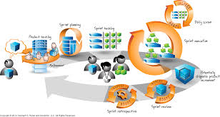
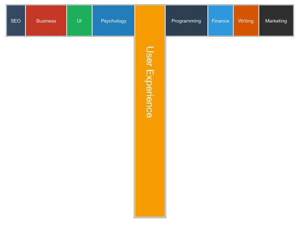

# 9/9/2020
1st assignment should have class diagram and ERD. 
## Project: 
ABET CAC
BBA/CIS accreditation  
WT has been accreidted for 8 years, renewed once.   
essentially our program will be a way to track abet accreditation criteria at WT. More detailed doc to be posted after the meeting.   There is a pre-existing system, but to not be as biased we (as a class) might not see it.   
Instructors file the abet reports? details about students performance. There is an annual assessment and evaluation retreat at the end of spring where instructors compile all the data.   
might have to do document storage. (manually add meta data, could attempt auto-extract?)
it's needed at least yearly.   
embedded rich text editor? has to be an asp.net library for that.   
WT's current system: pars.cis.wtamu.edu  
instructors proof for assessment results need to be submitted as well, essentially we need to see the work on how they graded students, how they arrived at that grade, ect...   
There is direct and indirect observations gathered from interactions with students.   
Section for reflection and afterthoughts of the class from instructors viewpoint.   
Lastly proposed actions for course improvement, instructors might list their thoughts on how they could improve the course next time. based on their own reflection and own analysis of the data.   
part taking in measurments, part reporting   
## SCRUM Expectations
we have to build something and deploy it, customer needs their own version persay.   

the above image arguably best represents the software development lifecycle according to scrum. client has an idea, gives his idea to developers who write out the features list (work log or backlog) and start developing features in sprints. Sprints are reviewed for effectiveness and effiency, was all of the work for the selected feature completed? if not we need to figure out what went wrong and attempt to fix it. typically there are daily scrum meetings. (as a class we'll meet 3-4 times a week, 4 preferably). Scrum master typically comes from dev team, sometimes it's from product owner. 
- product backlog is a list of features to be developed.
- story narrative (user story)
    - as a ... I want ... so that ...
    - Ex. as a client I want a video game so that I can make money
- acceptance criteria
    - given ... when ... then ...
    - given the circumstance on this occasion I see this behavior?  

gherkin notation? 

T-Shaped skill: 
- broad skills and deep skills.  
