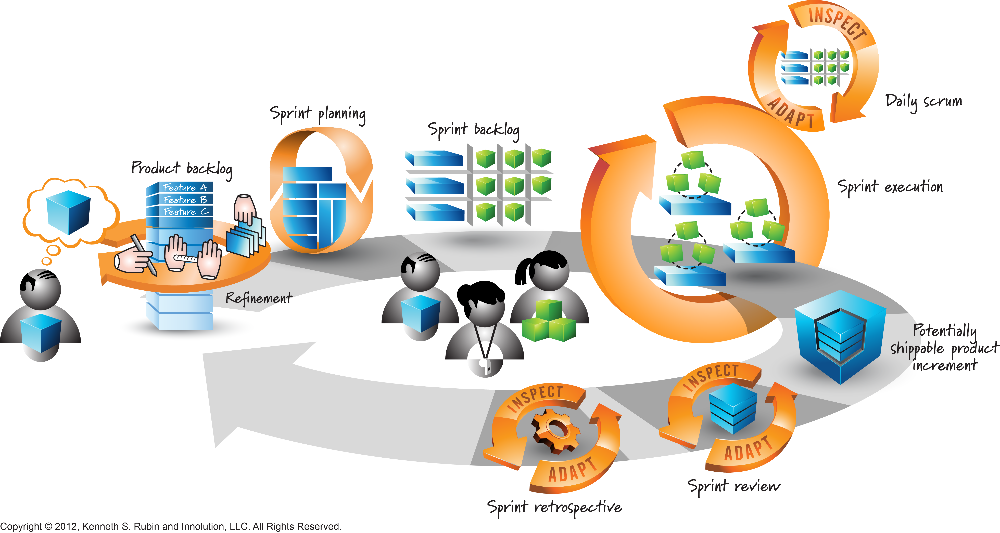

# 9/9/2020
1st assignment should have class diagram and ERD. 
## Project: 
ABET CAC
BBA/CIS accreditation  
WT has been accreidted for 8 years, renewed once.   
essentially our program will be a way to track abet accreditation criteria at WT. ~~More detailed doc to be posted after the meeting.~~ Posted in the docs folder of project repo.  
 There is a pre-existing system, but to not be as biased we (as a class) might not see it.   
Instructors file the abet reports? details about students performance. There is an annual assessment and evaluation retreat at the end of spring where instructors compile all the data.   
might have to do document storage. (manually add meta data, could attempt auto-extract?)
it's needed at least yearly.   
embedded rich text editor? ~~has to be an asp.net library for that.~~ [there is a few available](https://visualstudiomagazine.com/articles/2016/01/01/8-rich-text-editors.aspx)  
WT's current system: pars.cis.wtamu.edu (Not externally accessable, assuming it's only on WT's LAN and only available to instructors)  
instructors proof for assessment results need to be submitted as well, essentially we need to see the work on how they graded students, how they arrived at that grade, ect...   
There is direct and indirect observations gathered from interactions with students.   
Section for reflection and afterthoughts of the class from instructors viewpoint.   
Lastly proposed actions for course improvement, instructors might list their thoughts on how they could improve the course next time. based on their own reflection and own analysis of the data.   
part taking in measurments, part reporting   
We will need to map Student Objectives (from ABET?) to the Course Learning Outcomes wich are set by WTAMU  
We can glimpse the current WTAMU system, in the apendix section of the CIDM ABET Assessment and Continuous Improvement Process Quick Guide in the docs folder.
## SCRUM Expectations
we have to build something and deploy it, customer needs their own version persay.   
5

the above image arguably best represents the software development lifecycle according to scrum. client has an idea, gives his idea to developers who write out the features list (work log or backlog) and start developing features in sprints. Sprints are reviewed for effectiveness and effiency, was all of the work for the selected feature completed? if not we need to figure out what went wrong and attempt to fix it. typically there are daily scrum meetings. (as a class we'll meet 3-4 times a week, 4 preferably). Scrum master typically comes from dev team, sometimes it's from product owner. 
- product backlog is a list of features to be developed.
- story narrative (user story)
    - as a ... I want ... so that ...
    - Ex. as a client I want a video game so that I can make money
- acceptance criteria
    - given ... when ... then ...
    - given the circumstance on this occasion I see this behavior?  

gherkin notation? 
- Babb had provided [this link](https://docs.behat.org/en/v2.5/guides/1.gherkin.html) for gherkin 

T-Shaped skill: 
- broad skills and deep skills.  

## 09/16/2020 Lecture:   
need to get sprint zero done, user stories ect...  
~~have to migrate to Jira~~  
have to get adam in meeting. Still no response from him (9/19/2020)  
2 meetings:  
- one with adam 
- one with babb  

product backlogg in jira  
have some user stories...  
~~determine roles within team.~~  

## notes and questions for Babb by next meeting (Time still TBD)
- What do faculty reports look like, can we get an example? 
    - current link in Babb's CIDM ABET Doc is dead
        - might have found the 2020-2021 version [here](http://www.abet.org/wp-content/uploads/2019/09/C002B-CAC-Self-Study-Questionnaire-2020-21-08-28-19.docx)
    - I would still like to see a full completed report. at least one for a course. 
- appears Program Educational objectives are independant of courses? However Courses are the main  contributor towards achieving program outcomes.   
    - **Program Educational Objectives** – These objectives should reflect the attributes of graduates after they've left the program for a period of up to 3 to 5 years. These are the desired qualities of the "product" of a program's activities. This means that tracking student progress beyond graduation is an important part of program assessment.
    - WTAMU BBA CIS Program Education Objectives: 
        1. (Applied Skills and Knowledge) Apply computer information systems knowledge and skills to work in a vibrant business environment.
        2. (Analysis and Design) Utilize core knowledge of computer information systems to synthesize, analyze, design, and implement solutions to real-world problems that enhances business decision-making processes.
        3. (Currency) Actively engage in life-long learning and professional development.
        4. (Teamwork) Work in teams to solve business problems by utilizing effective communication and collaboration skills.
- Student Educational Objectives map to Program Educational objectives
    - **Student Outcomes** - Attributes of student achievement that can be measured at graduation. The purpose of a program outcome is to describe the exit qualities of a student upon completion of and graduation from the program. These are short-term measurable objectives.
    - WTAMU BBA CIS Student Outcomes: 
        1. SO1: An ability to analyze a complex computing problem and to apply principles of computing and other relevant disciplines to identify solutions
        2. SO2: An ability to design, implement, and evaluate a computing-based solution to meet a given set of computing requirements in the context of the program’s discipline
        3. SO3: An ability to communicate effectively in a variety of professional contexts
        4. SO4: An ability to recognize professional responsibilities and make informed judgments in computing practice based on legal and ethical principles
        5. SO5: Function effectively as a member or leader of a team engaged in activities appropriate to the program’s discipline
        6. SO6: An ability to support the delivery, use, and management of information systems within an information systems environment.
- From what I understand, Course learning outcomes map to Student objectives, from there we can determine how well Program Educational Objectives are covered? 