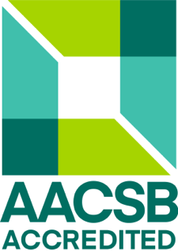

# Conflict Resolution and Negotiation 

## Books
- "Getting to Yes" by Roger Fisher and William Ury (revised edition with Bruce Patton) 
    - ISBN: 978-0-14-311875-6
  - Harvard Business Essentials: Negotiation
    - ISBN: 978-1-59139-111-1

## Notes
- [Getting to Yes](./getting_to_yes.md)
- [Harvard Business Essentials: Negotiation](notes.md)

## **Course Description**

A study of conflict resolution and negotiation tactics employed in an organizational setting. Course coverage includes management theories applied to conflict resolution and the use of communication tools relevant to resolution and negotiations.

### **Course Objectives**

The students in this course will:

- Define conflict and predict reactions to conflict based on a person’s conflict style.
- Recognize the costs and benefits of conflict in the workplace.
- Analyze how unresolved conflict relates to organizational productivity.
- Understand and analyze the role of negotiation in managing conflict.
- Analyze and describe the differences between conflict management processes in various business environments.
- Understand how to manage multi-party and multi-group negotiation processes.
- Students will complete an in-depth analysis of a conflict resolution or negotiation strategy.

# **WTAMU Paul and Virginia Engler College of Business Mission Statement**

The mission of the Paul and Virginia Engler College of Business is to provide high quality undergraduate and graduate business education with a global perspective and ethical awareness. We accomplish this through emphasis on excellence in teaching, which is strengthened by faculty scholarship and supported by professional service.

## **Learning Objectives of the WTAMU Paul and Virginia Engler College of Business Programs**

The Paul and Virginia Engler College of Business (COB) at West Texas A&M University (WTAMU) seeks to prepare students in the Bachelor of Business Administration (BBA), Master of Business Administration (MBA), Master of Professional Accounting (MPA), Master of Science in Computer Information Systems and Business Analytics (MSCISBA) and the Master of Science Finance and Economics (MSFE) degree programs for careers in business and to foster their professional growth and advancement via key learning goals and objectives.

The learning objectives of the Paul and Virginia Engler College of Business are as follows:

- Leadership
- Communication
- Critical Thinking
- Business Integration
- Core Business Knowledge
- Global Business Environment
- Business Ethics and Corporate Governance

# **WTAMU Paul and Virginia Engler COB Student Code of Ethics**

Each student enrolled in COB courses accepts personal responsibility to uphold and defend academic integrity and to promote an atmosphere in which all individuals may flourish. The COB Student Code of Ethics strives to set a standard of honest behavior that reflects well on students, the COB and West Texas A&M University. All students enrolled in business courses are expected to follow the explicit behaviors detailed in the Student Code of Ethics.

## **Code of Ethics**

- Do not use notes, texts, solution manuals, or other aids for a quiz or exam without instructor authorization.
- Do not copy the work of others and/or allow others to view your answers or copy your work during a quiz, exam, or on homework assignments.
- Do not allow other parties to assist in the completion of your quiz, exam, homework, paper, or project when not permitted.
- Do not work with other students on projects or assignments without authorization from the course instructor.
- Properly cite and specifically credit the source of text, graphic, and web materials in papers, projects, or other assignments.
- Do not forge the signature of an instructor, advisor, dean, or another student.
- Provide truthful information for class absences when asking faculty for excused absences or for a make-up for a quiz, exam, or homework.
- Provide truthful information on your resume including work history, academic performance, leadership activities, and membership in student organizations.
- Respect the property, personal rights, and learning environment of all members of the academic community. This includes posting, sharing, and otherwise distributing the course materials outside of this course without expressed permission of the faculty, college, university, or system.
- Live up to the highest ethical standards in all academic and professional endeavors.

Students violating the Student Code of Ethics will be reported to the Dean’s office and are subject to penalties described in the West Texas A&M University Code of Student Life, which may include suspension from the University. In addition, a violator of the Student Code of Ethics may become ineligible for participation in student organizations sponsored by the COB and for recognition for College academic honors, awards, and scholarships.

## **Academic Integrity**

All work must be completed individually unless otherwise stated. Commission of any of the following acts shall constitute scholastic dishonesty: acquiring or providing information for any assigned work or examination from any unauthorized source; informing any person or persons of the contents of any examination prior to the time the exam is given in any subsequent sections of the course or as a makeup; plagiarism; submission of a paper or project that is substantially the same for two courses unless expressly authorized by the instructor to do so. For more information, see the [Code of Student Life](https://www.wtamu.edu/webres/File/Student%20Life/Code-of-Student-Life.pdf).

# **Viewpoints/External Websites Disclaimer**

The views expressed in this document, web-based course materials, and/or classroom presentations and discussions are those of the professor and do not necessarily represent the views of West Texas A&M University, its faculty and staff, or its students. Views expressed by students are likewise those of the person making such statements. It is understood and expected that each individual within this course will respect and allow individual difference of opinion.

Neither the professor, the COB, nor WTAMU are responsible for the content of external websites discussed in the classroom and/or linked to via online course materials, emails, message boards, or other means. Referred websites are for illustrative purposes only, and are neither warranted nor endorsed by the professor, COB, or WTAMU. Web pages change frequently, as does domain name ownership. While every effort is made to ensure proper referencing, it is possible that students may on occasion find materials to be objectionable for reasons beyond our control.

The notes within the repository as it relatest to this class and any others unless otherwise stated, are explicitly my own and do not reflect WTAMU, WTAMU COB or the authors viewpoints at all. 

  

